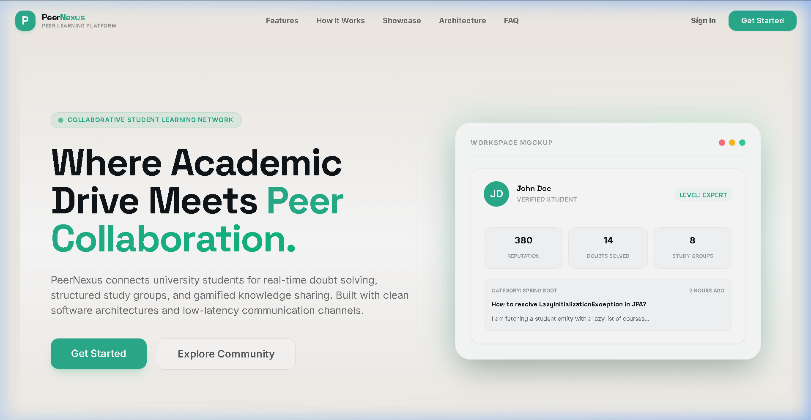
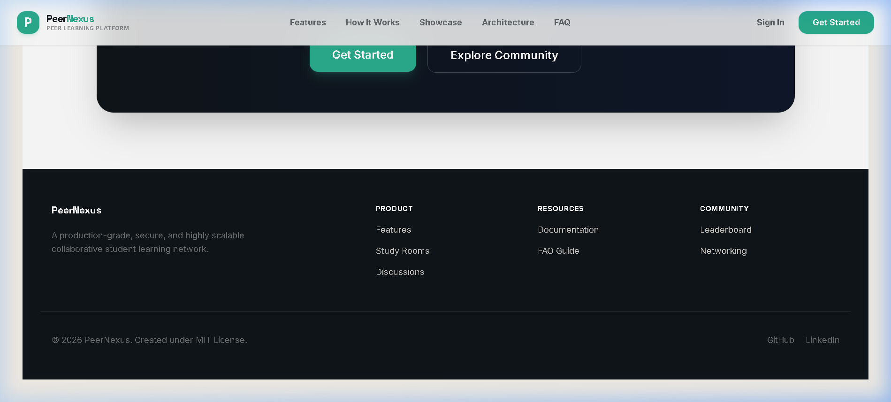
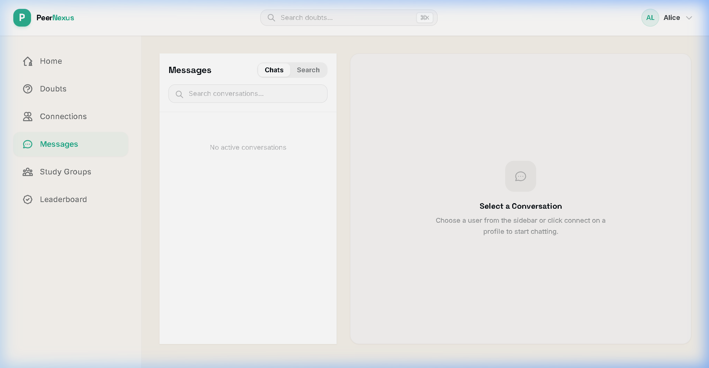

# PeerNexus

[](https://spring.io/projects/spring-boot)
[](https://react.dev/)
[](https://www.postgresql.org/)
[](https://www.docker.com/)
[](LICENSE)

PeerNexus is a production-grade, secure, and highly scalable collaborative student learning platform. It serves as a modern student community network that bridges peer-to-peer knowledge sharing with real-time communication. PeerNexus combines a forum-style **Doubt Solving Engine**, a gamified **Reputation System**, instant **Private Messaging** (featuring real-time statuses, inline editing, group chats, message pinning, and reactions), and structured **Study Groups** into a unified collaborative workspace.

Designed with a focus on web security, clean architecture, and database query optimization, the platform is fully containerized and deployable via Docker.

---

## Live Demo & Repositories
* **Live Client Link**: https://peernexus.vercel.app
* **API Documentation**: `http://localhost:8080/swagger-ui.html` (Local development)
* **GitHub Repository**: [https://github.com/vivekkushwahaofficial/peernexus](https://github.com/vivekkushwahaofficial/peernexus)

---

## Table of Contents
1. [Overview](#overview)
2. [Key Highlights](#key-highlights)
3. [Architecture Overview](#architecture-overview)
4. [Features](#features)
5. [Technology Stack](#technology-stack)
6. [System Design](#system-design)
7. [Database Schema](#database-schema)
8. [API Documentation](#api-documentation)
9. [Security Features](#security-features)
10. [Screenshots](#screenshots)
11. [Local Setup](#local-setup)
12. [Deployment Guide](#deployment-guide)
13. [Why I Built This Project](#why-i-built-this-project)
14. [Resume Value](#resume-value)
15. [Future Improvements](#future-improvements)
16. [Contributing](#contributing)
17. [License](#license)
18. [Author](#author)

---

## Overview

PeerNexus was designed to bridge the gap between academic isolation and structured peer learning. In typical university communities, students face scattered channels, unmoderated chat platforms, and slow responses on traditional discussion forums. 

PeerNexus addresses this by introducing:
* **Structured doubt-solving modules** with category filters and accepted solution credit rewards.
* **Low-latency real-time workspace chat** channels for study groups and private connections.
* **A gamified contribution architecture** utilizing a transactional reputation ledger that updates status tiers dynamically.
* **Granular moderation tools** to maintain community integrity through warn, suspend, and ban workflows.

---

## Key Highlights
* **JWT Double-Token Authentication:** Highly secure session validation using short-lived access tokens (15 minutes) and DB-stored SHA-256 hashed refresh tokens (30 days).
* **Role-Based Access Control (RBAC):** Hierarchical endpoints restricted to `STUDENT`, `VERIFIED_STUDENT`, `MODERATOR`, and `ADMIN` users.
* **WebSocket Real-Time layer:** SockJS + STOMP protocol handlers for messaging, typing bubbles, message reactions, and online presence tracking.
* **Secured Group Subscriptions:** Custom WebSocket channel interceptors validating database study group membership prior to allowing connection mappings.
* **Relational Database Design:** PostgreSQL schema with strict constraints, indexes on lookup paths, and Flyway migration controls.
* **Cloudinary Media Pipeline:** Multi-purpose file streaming mapping user avatars, group headers, and doubt attachments directly to CDN cloud storage.
* **Full-Stack Containerization:** Multi-stage production builds for backend JAR and frontend Nginx configuration deployable via Docker Compose.

---

## Architecture Overview

PeerNexus follows a decoupled client-server architecture. Client applications interact via a secure HTTPS REST gateway and persistent WebSockets channels.

```text
                               +----------------------------------+
                               |           User Browser           |
                               +----------------------------------+
                                             |        ^
                                  HTTPS REST |        |  STOMP WebSockets
                                             v        v
                               +----------------------------------+
                               |    Nginx Reverse Proxy / CORS    |
                               +----------------------------------+
                                             |        ^
                                             v        |
                               +----------------------------------+
                               |  Spring Boot 3 Backend Service   |
                               +----------------------------------+
                                 /           |           \
                    JPA / SQL   /            |            \   Multipart Stream
                               v             v             v
                          +----------+  +------------+  +---------------+
                          | Postgres |  | H2 Memory  |  |  Cloudinary   |
                          | Database |  | (Testing)  |  |  Media Cloud  |
                          +----------+  +------------+  +---------------+
```

---

## Features

### 🔐 Authentication & Security
* **Stateless Session Control:** Ephemeral cryptographically signed JWT access tokens handle authentication, limiting database load.
* **Dual-Token Handshake:** Refresh token updates generate secure session intervals without logging users out repeatedly.
* **Registration Validation:** Single-use verification codes sent via email to restrict registrations to authorized college sub-domains.
* **Password Recoveries:** Secure password resets utilizing short-lived cryptographic hash keys.
* **Method-Level Restrictions:** Dynamic endpoint checks matching role hierarchies (`STUDENT` < `VERIFIED_STUDENT` < `MODERATOR` < `ADMIN`).

### 👤 User Profiles
* **Live Presence Indicator:** Active, away, or last-seen metadata updated dynamically via WebSocket session event listeners.
* **Detailed Portfolios:** Showcases user bios, academic skills, research interests, and earned reputation tiers.
* **Avatar Cloud Pipeline:** Secure profile image uploads mapped to Cloudinary, ensuring background assets are deleted when profile updates occur.

### ❓ Doubt Solving System
* **Markdown Discussion Thread:** Supports formatting text, tables, code blocks, and image layouts.
* **Categorized Discovery:** Browse doubts using custom subject tags and course categories.
* **Upvote / Downvote Controls:** Encourages community content moderation through voting logs on answers.
* **Accept Resolution Flag:** Doubt authors can highlight a solution, lock the thread, and transfer reputation points to the replier.

### 👥 Study Groups
* **Study Rooms Discovery:** Discovery panel displaying public search terms, topics, and descriptions.
* **Access Control Lists:** Private groups utilize a join request log reviewed by group owners/admins.
* **Moderation & Promotion:** Group owners can kick members, promote users to admin, or transfer ownership.
* **Dedicated WebSocket Channels:** Encrypted real-time group conversations restricted to verified members.

### 💬 Real-Time Messaging
* **Low-Latency Chat Threads:** Instant private messages with typing indicators and read receipts.
* **Message Management:** Edit messages (within 15 minutes) or delete them for everyone (within 1 hour).
* **Pinning & Reactions:** Pinned message alerts displayed in channel banners; support for standard message reactions.
* **Local Message Deletion:** Allows hiding chats using "Delete for me" database flags.

### 🏆 Reputation System
* **Transactional Point Ledger:** Secure log entries tracking point history (`ANSWER_POSTED`, `ANSWER_ACCEPTED`, `UPVOTE_RECEIVED`).
* **Dynamic Ranking Badges:** Automatic upgrades as reputation grows (Beginner -> Contributor -> Mentor -> Expert -> Legend).
* **Global Leaderboards:** Real-time ranks displaying top contributors.

### 🛡️ Moderation & Audits
* **Content Reporting:** Users can flag content (doubts, answers, groups, messages) for moderation review.
* **Penalty Console:** Moderators can warn, temporarily suspend, or permanently ban users.
* **Security Audit Logs:** Permanent audit trails mapping admin actions for compliance.

### 🔔 Notifications
* **Live Alerts:** Real-time push notifications for connections, answers, upvotes, and moderator warnings.

---

## Technology Stack

| Layer | Component | Version | Description |
| :--- | :--- | :--- | :--- |
| **Frontend** | React | 18.3.1 | UI library for view layers |
| | Vite | 5.4.0 | Build compiler & hot-reloading dev server |
| | Tailwind CSS | 3.4.9 | Styling framework with custom configurations |
| | React Router Dom | 6.26.1 | Client-side page routing & layout mappings |
| | TanStack Query | 5.51.0 | State caching, automatic queries refetching |
| | Axios | 1.7.3 | HTTP client with interceptors for auth headers |
| | STOMP JS / SockJS | 7.3.0 / 1.6.1 | WebSocket orchestration and heartbeat sync |
| **Backend** | Spring Boot | 3.5.14 | Core REST & WebSocket microservices layer |
| | Spring Security | 6.x | Security Filter Chain & RBAC validation |
| | JWT (JJWT) | 0.12.5 | Cryptographic user token generator |
| | MapStruct | 1.5.5.Final | Type-safe mappings between entities and DTOs |
| | Hibernate / JPA | 6.x / 3.x | ORM mapping database tables |
| | Spring Mail | 3.x | Transactional registration and reset emails |
| **Database** | PostgreSQL | 16.x (Alpine) | Transactional, indexed data storage |
| | Flyway | 10.x | Schema migrations and structure versioning |
| | H2 Database | 2.2.x | In-memory relational database for unit tests |
| **DevOps** | Docker | 26.x | Container deployment package compiler |
| | Docker Compose | 3.9 | Multi-container environment orchestrator |

---

## System Design

### 1. Authentication Flow
```text
[User Client]           [AuthController]          [DB/PostgreSQL]         [SMTP Server]
      |                        |                         |                      |
      |--- POST /register ---->|                         |                      |
      |                        |--- Save User (unverified)-->|                  |
      |                        |--- Generate verification ----|                  |
      |                        |--- Send verification email ------------------->|
      |                        |                         |                      |
      |--- GET /verify ------->|                         |                      |
      |                        |--- Update enabled=true->|                      |
      |                        |<-- Success HTTP 200 ----|                      |
      |                        |                         |                      |
      |--- POST /login ------->|                         |                      |
      |                        |--- Validate bcrypt hash |                      |
      |                        |--- Generate JWT Access  |                      |
      |                        |--- Save Refresh Token ->|                      |
      |<-- Return Access JWT --|                         |                      |
```

### 2. Request Lifecycle (Security Filters)
```text
[Incoming HTTP Request]
          |
          v
[JwtAuthenticationFilter] 
          |---> Extracts Token from "Authorization: Bearer <token>"
          |---> Validates Token Signature & Expiry
          |---> Valid: Sets Authentication in SecurityContextHolder
          |---> Invalid: Bypasses Filter (leaves context empty)
          v
[Spring Security Filter Chain]
          |---> Checks URL mapping constraints
          |---> Allowed: Passes request to RestController
          |---> Blocked: Returns HTTP 401 Unauthorized
          v
[RestController Controller Handler]
          |---> Checks method level annotations (@PreAuthorize)
          |---> Passes execution to Transactional Service
```

### 3. WebSocket Connection & Subscription Security
```text
[Client WS Connection]
          |
          v--- STOMP CONNECT Frame (nativeHeaders: "Authorization: Bearer <token>")
[WebSocketSecurityConfig Interceptor]
          |--- Extract Token & Validate signature via JwtService
          |--- Valid: Set user principal on connection session
          |--- Invalid: Reject Connection, Throw IllegalArgumentException
          |
          v--- STOMP SUBSCRIBE Frame (destination: "/topic/group.{groupId}")
[WebSocketSecurityConfig Interceptor]
          |--- Extract group ID & Authenticated user ID from principal
          |--- Check membership (existsByGroupIdAndUserId) in DB
          |--- Is Member: Complete subscription stream mappings
          |--- Not Member: Send STOMP ERROR Frame, Deny Subscription
```

---

## Database Schema

```text
               +-----------------------------+
               |            users            |
               +-----------------------------+
               | PK  id (bigint)             |
               |     email (varchar)  [UQ]   |
               |     password (varchar)      |
               |     role (varchar)          |
               |     reputation_points (int) |
               +-----------------------------+
                 ^    ^      ^    ^      ^
                 |    |      |    |      |
        +--------+    |      |    |      +--------+
        |             |      |    |               |
        v             |      |    v               v
  +-----------+       |      |  +-----------+   +-------------+
  |  doubts   |       |      |  |connections|   |group_members|
  +-----------+       |      |  +-----------+   +-------------+
  | PK  id    |       |      |  | PK  id    |   | PK  id      |
  | FK  author|<------+      |  | FK  reques|   | FK  group_id|
  +-----------+              |  | FK  recip |   | FK  user_id |
    ^                        |  +-----------+   +-------------+
    |                        |                    ^
    v                        v                    |
  +-----------+            +------------+         v
  |  answers  |            | chat_rooms |       +-------------+
  +-----------+            +------------+       |study_groups |
  | PK  id    |            | PK  id     |       +-------------+
  | FK  doubt |            | FK  user1  |       | PK  id      |
  | FK  author|<-----------| FK  user2  |       +-------------+
  +-----------+            +------------+
                             ^
                             |
                             v
                           +------------+
                           |  messages  |
                           +------------+
                           | PK  id     |
                           | FK  room_id|
                           | FK  sender |
                           +------------+
```

### Core Entity Explanations
* **`User`**: The central actor. Stores credentials, roles (`STUDENT`, `VERIFIED_STUDENT`, `MODERATOR`, `ADMIN`), reputation point ledger tallies, academic bios, interests, and profile verification status flags.
* **`Doubt`**: Academic questions. Holds markdown contents, subject categories, resolved status metadata, and binds to its author.
* **`Answer`**: Doubt replies. Tracks upvotes/downvotes via transactional joins and records if the answer is accepted as the correct solution.
* **`StudyGroup`**: Group learning modules. Stores group topics, cover avatars, privacy settings (Public vs Private), and member statistics.
* **`GroupMember`**: Join mapping table tracking roles (`OWNER`, `ADMIN`, `MEMBER`) and join timestamps for users within study groups.
* **`ChatRoom`**: Relational bridge between two connected users. Restricts room creations unless connection statuses are set to `ACCEPTED`.
* **`Message`**: Instant message records. Tracks file attachments, sender mappings, read receipts, and soft-delete visibility flags.
* **`ReputationTransaction`**: Points transaction table storing ledger histories for audit checks, preventing point tampering.

---

## API Documentation

### Authentication (`/api/auth`)
| Method | Endpoint | Payload | Description |
| :--- | :--- | :--- | :--- |
| **POST** | `/api/auth/register` | `SignupRequest` JSON | Register new user profile |
| **POST** | `/api/auth/login` | `LoginRequest` JSON | Authenticate credentials & return JWT keys |
| **POST** | `/api/auth/refresh` | Query Header token | Exchange refresh token for fresh access JWT |
| **POST** | `/api/auth/logout` | None | Revoke refresh token and invalidate session |
| **GET** | `/api/auth/verify` | `?token=...` | Validate registration email token |
| **POST** | `/api/auth/forgot-password`| `EmailRequest` JSON | Generate reset token and dispatch email |
| **POST** | `/api/auth/reset-password` | `ResetRequest` JSON | Finalize password reset using token |

### User Directory & Connections (`/api/users` & `/api/connections`)
| Method | Endpoint | Role Allowed | Description |
| :--- | :--- | :--- | :--- |
| **GET** | `/api/users/me` | `STUDENT` | Fetch active user profile and authorities |
| **GET** | `/api/users/{id}` | `STUDENT` | Fetch public profile metadata of a student |
| **PUT** | `/api/users/me` | `STUDENT` | Update profile bio, skills, and interests |
| **POST** | `/api/connections/request`| `STUDENT` | Send connection request to another student |
| **POST** | `/api/connections/{id}/accept`| `STUDENT` | Accept incoming connection request |
| **DELETE**| `/api/connections/{id}` | `STUDENT` | Terminate established peer connection |
| **GET** | `/api/connections` | `STUDENT` | List active peer connections (paginated) |

### Doubt Forum (`/api/doubts` & `/api/answers`)
| Method | Endpoint | Role Allowed | Description |
| :--- | :--- | :--- | :--- |
| **GET** | `/api/doubts` | `ANONYMOUS` | List doubts feed (paginated) |
| **POST** | `/api/doubts` | `VERIFIED_STUDENT`| Create a new doubt entry |
| **DELETE**| `/api/doubts/{id}` | `MODERATOR` | Delete doubt post (owner/moderator only) |
| **POST** | `/api/answers` | `VERIFIED_STUDENT`| Submit answer text for a doubt |
| **POST** | `/api/answers/{id}/accept`| `VERIFIED_STUDENT`| Accept answer as solution (owner only) |
| **POST** | `/api/answers/{id}/vote` | `VERIFIED_STUDENT`| Cast upvote/downvote for answer |

### Real-Time Chat & Inbox (`/api/chat` & `/api/group-chat`)
| Method | Endpoint | Role Allowed | Description |
| :--- | :--- | :--- | :--- |
| **GET** | `/api/chat/rooms` | `STUDENT` | Retrieve chat rooms inbox feed with counts |
| **POST** | `/api/chat/rooms/{userId}/or-create`| `STUDENT` | Open chat room with user (needs accepted connection) |
| **GET** | `/api/chat/rooms/{roomId}/messages`| `STUDENT` | Paginated message logs history |
| **GET** | `/api/group-chat/{groupId}/messages`| `STUDENT` | Paginated message history for study groups |
| **POST** | `/api/chat/messages/{messageId}/pin`| `STUDENT` | Pin/unpin a message in the room |

---

## Security Features

* **JWT Stateless Token Filter:** Authenticates REST requests intercepting Header keys on every call, maintaining a stateless runtime footprint.
* **Hibernate Dirty-Check Protection:** Plaintext verification keys are detached from database persistence states (`entityManager.detach`) upon processing, blocking accidental updates during dirty-checks.
* **IDOR Protection:** Ownership validators verify resource creators at the service layer before allowing resource mutations (edits, deletions, status changes).
* **Input Sanitization & File Filters:** Upload interceptors block Windows executables (by validating header signatures and rejecting byte-patterns) and whitelist image formats.
* **WebSocket Heartbeats & Interceptors:** Handshake interceptors validate tokens prior to connection, and check group memberships dynamically during subscription handshakes.
* **Strict CORS Boundaries:** Whitelists client origins dynamically through production config variables, blocking wildcard (`*`) access credentials.

---

## Screenshots

### 1. Landing Page (Audited & Responsive)


### 2. Landing Page (Audited & Responsive)


### 3. Student Authentication Gateway


### 4. Workspace Dashboard & Doubt Forum


### 5. WebSocket Real-Time Chat Interface


---

## Local Setup

### Prerequisites
1. **Java SDK 21** (JDK runtime environment)
2. **Maven 3.9+** (Dependency builds compiler)
3. **Node.js 18+ & npm** (Frontend runtime package managers)
4. **PostgreSQL 16** (Persistent database layer)
5. **Cloudinary account** (Media CDN credentials)

### Backend Configuration
1. Navigate to the backend directory:
   ```bash
   cd peernexus-backend
   ```
2. Copy the template `.env.example` file to `.env` and populate your database, email server, and Cloudinary credentials:
   ```bash
   cp .env.example .env
   ```
3. Compile the application:
   ```bash
   ./mvnw clean install
   ```
4. Start the Spring Boot API server:
   ```bash
   ./mvnw spring-boot:run
   ```

### Frontend Configuration
1. Navigate to the frontend directory:
   ```bash
   cd ../peernexus-frontend
   ```
2. Create your local environment configuration file:
   ```bash
   cp .env.example .env.local
   ```
3. Install package dependencies:
   ```bash
   npm install
   ```
4. Launch the local development hot-reloading server:
   ```bash
   npm run dev
   ```
   The client will boot on `http://localhost:5173`.

### Full-Stack Docker Container Compose Setup
To spin up the database, Spring Boot microservices, and Nginx frontend server:
1. Ensure your `.env` variables at the project root folder are populated.
2. Build and launch the containers:
   ```bash
   docker compose up --build
   ```
   The application will be accessible at `http://localhost:3000`.

---

## Deployment Guide

### Backend & Database (Render, AWS)
1. Provision a managed PostgreSQL DB instance and set up production environment variables.
2. Link the repository, setting the build root folder to `peernexus-backend`.
3. Set the build compile command:
   ```bash
   ./mvnw clean package -DskipTests
   ```
4. Configure the start execution parameter:
   ```bash
   java -jar target/peernexus-0.0.1-SNAPSHOT.jar
   ```

### Frontend Static Build (Vercel)
1. Add the project directory pointing to `peernexus-frontend`.
2. Configure environment settings:
   * **Build Command:** `npm run build`
   * **Output Directory:** `dist`
3. Add the `VITE_API_BASE_URL` environment variable pointing to the deployed backend endpoint.

---

## Why I Built This Project

PeerNexus was built to solve the challenges of academic isolation. During intensive coursework, students often get stuck on conceptual bugs, coding errors, or design architectures, wasting hours without validation. Communication is typically scattered across unmoderated channels, and public forums have slow response times.

### Engineering Challenges Solved:
1. **State & Connection Synchronization:** Integrating low-latency WebSockets with Spring Security's thread-local security context. I implemented custom channel interceptors to extract and validate JWT tokens on `CONNECT` frames.
2. **Subscription Leak Prevention:** Preventing unauthorized users from listening to private study group channels. I designed runtime subscription checks that validate membership against the database before allowing subscription mapping.
3. **Database Performance & N+1 Queries:** Optimizing complex feeds (e.g., matching users, doubt replies, reputation scores). I resolved N+1 query bottlenecks by defining custom JPA Join Fetch mappings, reducing database calls on dashboard loads.

---

## Resume Value

PeerNexus shows a strong grasp of core full-stack engineering skills, going beyond simple CRUD architectures:
* **Production Operations:** Hands-on experience with multi-stage Docker builds, Nginx static host maps, and automated Flyway database migrations.
* **Security Engineering:** Clean implementations of dual-token JWT rotation, CSRF/CORS filters, IDOR protections, and file-upload interceptors.
* **Event-Driven Services:** Practical knowledge of STOMP heartbeats, WebSocket handshakes, and stateful tracking.

---

## Future Improvements

* **Redis Caching Layer:** Offload WebSocket session mappings and user presence tracking to Redis, enabling horizontal backend scaling.
* **Elasticsearch Integration:** Replace standard JPA SQL searches with a dedicated Elasticsearch indexing service to support fuzzy matches and file parsing.
* **WebRTC Live Study Rooms:** Add peer-to-peer virtual audio/video connections within group workspaces.
* **AI Doubt Moderation:** Implement a local LLM API to auto-classify categories, filter spam, and flag toxic replies.

---

## Contributing

1. Fork the repository.
2. Create your Feature Branch: `git checkout -b feature/NewFeature`
3. Commit your changes: `git commit -m 'Add NewFeature'`
4. Push to the branch: `git push origin feature/NewFeature`
5. Open a Pull Request.

---

## License

This project is licensed under the MIT License. See the [LICENSE](LICENSE) file for details.

---

## Author

* **Vivek Kushwaha** - *Full Stack Developer
B.Tech CSE Student
Oriental Institute of Science & Technology*
  * **GitHub**: [github.com/vivekkushwahaofficial](https://github.com/vivekkushwahaofficial)
  * **LinkedIn**: [linkedin.com/in/vivekkushwahaofficial](https://www.linkedin.com/in/vivekkushwahaofficial)
  * **Portfolio**: [vivekkushwaha.dev](https://vivekkushwahaofficial.tech)
