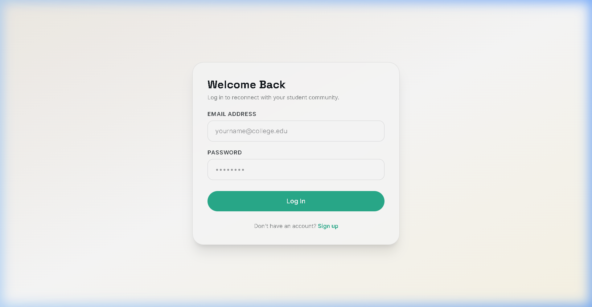
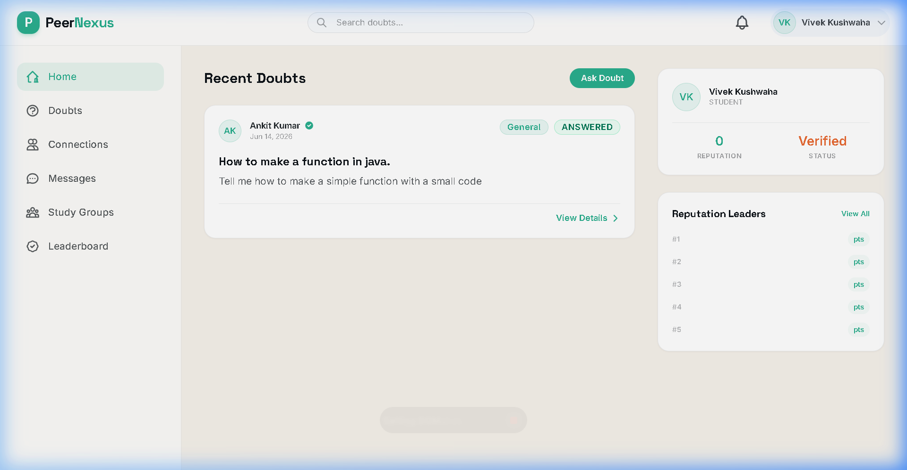

# PeerNexus

[](https://spring.io/projects/spring-boot)
[](https://react.dev/)
[](https://www.postgresql.org/)
[](https://www.docker.com/)
[](LICENSE)

PeerNexus is a production-grade, secure, and highly scalable collaborative student learning platform. It serves as a modern student community network that bridges peer-to-peer knowledge sharing with real-time communication. PeerNexus combines a forum-style **Doubt Solving Engine**, a gamified **Reputation System**, instant **Private Messaging** (with real-time checkmarks, message editing, deleting, pinning, and reactions), and structured **Study Groups** into a unified collaborative workspace.

Designed with a focus on web security, clean architecture, and database query optimization, the platform is fully containerized and deployable via Docker.

---

## Architecture Overview

PeerNexus follows a decoupled client-server architecture with secure real-time communication pathways:

```text
                  +----------------------------------+
                  |           User Browser           |
                  +----------------------------------+
                               |        ^
                    HTTPS REST  |        |  STOMP WebSockets
                               /        /
                  +----------------------------------+
                  |    Nginx Reverse Proxy / CORS    |
                  +----------------------------------+
                               |        ^
                               /        |
                  +----------------------------------+
                  |  Spring Boot 3 Backend Service   |
                  +----------------------------------+
                    |           |           |
       JPA / SQL    |           |           |  API Uploads
     +--------------+           |           +---------------+
     v                          v                           v
+----------+             +------------+             +---------------+
| Postgres |             | H2 Memory  |             |  Cloudinary   |
| Database |             | (Testing)  |             | Media Cloud   |
+----------+             +------------+             +---------------+
```

### Communication Flows
1. **WebSocket STOMP Channel:** Clients open connections via SockJS to the `/ws` handshake endpoint. The interceptor extracts the JWT token, validates signatures, and maps the authenticated user principal. Message packets are routed downstream to user-private queues (`/user/queue/chat`) or public group topics (`/topic/group.{groupId}`).
2. **Cloudinary Upload Stream:** Media attachments are sent as `multipart/form-data` to backend endpoints, validated for size/type, and streamed directly to Cloudinary using UUID-prefixed file signatures, returning secure HTTPS URLs.
3. **Double-Token Authentication:** Security uses short-lived JWT Access Tokens (15-minute expiration) and database-stored SHA-256 hashed Refresh Tokens (30-day expiration) to manage user sessions securely.

---

## Technology Stack

| Component | Technology | Version | Purpose |
| :--- | :--- | :--- | :--- |
| **Frontend** | React | 18.3.1 | User interface rendering |
| | Vite | 5.4.0 | Build tool and dev server |
| | React Router Dom | 6.26.1 | Declarative routing & layout management |
| | Tailwind CSS | 3.4.9 | Utility-first responsive styling |
| | TanStack Query | 5.51.0 | Server state caching and refetching |
| | Axios | 1.7.3 | HTTP client with security interceptors |
| | STOMP JS & SockJS | 7.3.0 / 1.6.1 | WebSocket protocol orchestration |
| **Backend** | Spring Boot | 3.5.14 | Core server application framework |
| | Spring Security | 6.x | Authorization & authentication filter chain |
| | JWT (JJWT) | 0.12.5 | Cryptographic user tokens |
| | MapStruct | 1.5.5.Final | Type-safe entity-to-DTO mappings |
| | Hibernate / JPA | 6.x / 3.x | Object-relational database mapping |
| | Spring Mail | 3.x | Transactional email integration |
| **Database** | PostgreSQL | 16.x (Alpine) | Persistent transactional storage |
| | Flyway | 10.x | Database schema migrations (V1 to V13) |
| | H2 Database | 2.2.x | In-memory database for testing suite |
| **DevOps** | Docker | 26.x | Containerization and deployment packaging |
| | Docker Compose | 3.9 | Multi-container environment orchestration |

---

## Features

### Authentication & Authorization
* **Secure JWT Session Control:** Stateless session management via short-lived JWT access tokens and long-lived refresh tokens.
* **Email Verification Token Flow:** Registration requires validation of a single-use verification token sent via SMTP.
* **Token-based Password Recovery:** Secure password resets using ephemeral verification codes.
* **Role-Based Access Controls (RBAC):** Strict endpoint protection for `STUDENT`, `VERIFIED_STUDENT`, `MODERATOR`, and `ADMIN` users.

### User Profile Management
* **Presence Tracking:** Live status indicators ("Active now", "Last seen X mins ago") managed via WebSocket listeners.
* **Detailed Academic Portfolios:** Customizable bio, skills, interests, and reputation tiers.
* **Profile Picture pipeline:** Direct uploads to Cloudinary with secure deletion logic.

### Doubt Solving Engine
* **Rich Markdown Editor & Feed:** Ask doubts with subject categorization, custom tagging, and image attachments.
* **Answer & Discussion Engine:** Threaded replies to doubts with upvote/downvote capabilities.
* **Accept Resolution Flag:** Doubt authors can accept an answer, highlighting it and locking resolution credits.

### Gamification & Reputation
* **Reputation Ledger:** Immutable transaction logs tracking point edits (+15 for accepted answer, +10 for received upvotes).
* **Reputation Tiers:** Rank badges starting at `BEGINNER` through `CONTRIBUTOR`, `MENTOR`, `EXPERT`, up to `LEGEND`.
* **Global Leaderboards:** Real-time ranks of the top contributors in the community.

### Real-Time Connections & Chat
* **Peer Verification Layer:** Chat messaging is disabled until users establish an `ACCEPTED` connection request.
* **WhatsApp-Grade Message Status:** Instant message status transitions (`SENT` -> `DELIVERED` -> `READ`).
* **Message Management:** Edit messages inline (within 15 minutes) or delete them for everyone (within 1 hour).
* **Reactions & Pinning:** Real-time message reactions and banner pinning with scroll-to-source click handling.
* **Local Deletion:** Users can hide messages from their workspace using "Delete for me".

### Study Groups
* **Discovery Board:** Categorized discovery search for public and private study groups.
* **Request & Approve Moderation:** Join requests for private groups reviewed by group owners/admins.
* **Interactive Chat Channels:** Dedicated WebSocket channels restricted to group members.

### Moderation & Audit System
* **Abuse Reporting:** Users can flag doubts, answers, messages, or groups for moderation review.
* **Moderator Penalty Suite:** Warn, suspend (temporary login blocks), or permanently ban users.
* **System Audit Trail:** Permanent audit logs capturing all admin actions for logging integrity.

---

## Folder Structure

```text
peernexus/
├── docker-compose.yml              # Multi-container orchestration config
├── .env.example                    # Template for required environment variables
├── README.md                       # Comprehensive project documentation
├── verify_group_enter_*.webp       # Media asset for visual validation
├── peernexus-backend/              # Spring Boot Backend Codebase
│   ├── Dockerfile                  # Multi-stage JVM runtime build instructions
│   ├── pom.xml                     # Maven dependency mapping
│   ├── schema.sql                  # Auto-generated SQL schema dump
│   ├── docs/                       # Modules API documentation
│   └── src/
│       ├── main/
│       │   ├── java/com/peernexus/peernexus/
│       │   │   ├── admin/           # Moderation, reports, dashboard and audit logging
│       │   │   ├── answer/          # Doubt replies and vote tracking
│       │   │   ├── auth/            # JWT validation, signup, reset tokens
│       │   │   ├── chat/            # Private chat room REST and STOMP handlers
│       │   │   ├── cloudinary/     # Cloudinary media upload/delete endpoints
│       │   │   ├── common/          # Global exceptions, standard response wrappers
│       │   │   ├── config/          # CORS, Spring Security, WebSockets mapping
│       │   │   ├── connection/      # Peer invitations network layer
│       │   │   ├── doubt/           # Forum doubt feed, tag aggregation
│       │   │   ├── group/           # Study group metadata, admin, and catalogs
│       │   │   ├── groupchat/       # Study group real-time messaging
│       │   │   ├── notification/   # In-app alert triggers and storage
│       │   │   ├── reputation/     # Point transaction engine and leaderboard
│       │   │   └── user/            # User profile services
│       │   └── resources/
│       │       ├── db/migration/   # Flyway versioned SQL scripts V1-V13
│       │       └── application.properties
│       └── test/                    # In-memory integration tests
└── peernexus-frontend/             # React Frontend Codebase
    ├── Dockerfile                  # Multi-stage Vite static Nginx build
    ├── package.json                # NPM dependency management
    ├── tailwind.config.js          # Styling configurations
    ├── vite.config.js              # Vite configurations
    └── src/
        ├── components/             # Reusable UI widgets and layout views
        ├── context/                # React state providers (Auth, WS)
        ├── hooks/                  # Custom hooks (WS handlers, UI helpers)
        ├── pages/                  # Views (DoubtFeed, Admin, ChatPage, etc.)
        ├── router/                 # Secure layout routing mapping
        ├── services/               # REST client modules (Axios setup)
        └── websocket/              # WebSocket configuration settings
```

---

## Database Schema

PeerNexus utilizes an optimized relational PostgreSQL database. Below are details of the database entities and relationships.

### Relational Schema Tables

#### `users`
| Field | Type | Constraint | Description |
| :--- | :--- | :--- | :--- |
| `id` | `bigint` | Primary Key | Generated automatically |
| `email` | `varchar(255)` | Unique, Not Null | University user email address |
| `name` | `varchar(255)` | Not Null | User profile display name |
| `password` | `varchar(255)` | Not Null | BCrypt hashed password string |
| `role` | `varchar(255)` | Not Null | Role: `STUDENT`, `VERIFIED_STUDENT`, `MODERATOR`, `ADMIN` |
| `reputation_points`| `integer` | Default `0` | Sum of earned reputation credits |
| `reputation_level` | `varchar(20)` | Not Null | Tier: `BEGINNER`, `CONTRIBUTOR`, `MENTOR`, `EXPERT`, `LEGEND` |
| `bio` | `varchar(500)` | Nullable | User-provided profile bio details |
| `skills` | `varchar(500)` | Nullable | User tags mapping academic skills |
| `interests` | `varchar(500)` | Nullable | Academic areas of interest |
| `enabled` | `boolean` | Default `true` | Status flag mapping moderation blocks |
| `verified` | `boolean` | Default `false` | True if verified via email token |
| `created_at` | `timestamp` | Not Null | Record creation timestamp |
| `updated_at` | `timestamp` | Not Null | Last record update timestamp |

#### `doubts`
| Field | Type | Constraint | Description |
| :--- | :--- | :--- | :--- |
| `id` | `bigint` | Primary Key | Generated automatically |
| `title` | `varchar(150)` | Not Null | Title of academic doubt |
| `content` | `varchar(5000)`| Not Null | Markdown content of question |
| `status` | `varchar(20)` | Not Null | Status: `OPEN`, `ANSWERED`, `CLOSED` |
| `author_id` | `bigint` | Foreign Key | Linked to `users.id` |
| `category_id` | `bigint` | Foreign Key | Linked to `categories.id` |

#### `answers`
| Field | Type | Constraint | Description |
| :--- | :--- | :--- | :--- |
| `id` | `bigint` | Primary Key | Generated automatically |
| `content` | `varchar(5000)`| Not Null | Text response markdown content |
| `accepted` | `boolean` | Not Null | Marked as accepted solution |
| `accepted_at` | `timestamp` | Nullable | Accepted timestamp |
| `author_id` | `bigint` | Foreign Key | Linked to `users.id` |
| `doubt_id` | `bigint` | Foreign Key | Linked to `doubts.id` |

#### `study_groups`
| Field | Type | Constraint | Description |
| :--- | :--- | :--- | :--- |
| `id` | `bigint` | Primary Key | Generated automatically |
| `name` | `varchar(100)` | Not Null | Name of the group |
| `topic` | `varchar(100)` | Nullable | Focus subject or topic |
| `description` | `varchar(1000)`| Nullable | Details regarding group goals |
| `image_url` | `varchar(500)` | Nullable | Group cover photo CDN address |
| `is_private` | `boolean` | Not Null | Restricted entry flag |
| `member_count` | `integer` | Default `1` | Denormalized count of group members |

#### `messages`
| Field | Type | Constraint | Description |
| :--- | :--- | :--- | :--- |
| `id` | `bigint` | Primary Key | Generated automatically |
| `chat_room_id` | `bigint` | Foreign Key | Linked to `chat_rooms.id` |
| `sender_id` | `bigint` | Foreign Key | Linked to `users.id` |
| `type` | `varchar(10)` | Not Null | Message Type: `TEXT`, `IMAGE`, `FILE` |
| `content` | `varchar(2000)`| Not Null | Message payload content |
| `file_name` | `varchar(255)` | Nullable | Filename for image/file uploads |
| `read_at` | `timestamp` | Nullable | Message read receipt timestamp |
| `deleted` | `boolean` | Default `false` | Status mapping "Delete for everyone" |
| `sent_at` | `timestamp` | Not Null | Dispatch timestamp |

### Key Entity Relationships
* **One-to-Many:**
  * `User` -> `Doubts` (A user can ask multiple doubts)
  * `User` -> `Answers` (A user can write multiple answers)
  * `Doubt` -> `Answers` (A doubt can have multiple answers)
  * `StudyGroup` -> `GroupMembers` (A group contains multiple member listings)
  * `ChatRoom` -> `Messages` (A private room contains multiple messages)
* **Many-to-Many:**
  * `Doubt` <-> `Tag` (Mapped via join table `doubt_tags` tracking tag classification)
* **One-to-One:**
  * `User` <-> `RefreshToken` (Unique session refresh reference mapping)
  * `User` <-> `EmailVerificationToken` (Ephemeral sign-up verification token)

---

## API Endpoints

### Authentication (`/api/auth`)
| Method | Endpoint | Description |
| :--- | :--- | :--- |
| **POST** | `/api/auth/register` | Register new user profile |
| **POST** | `/api/auth/login` | Authenticate user & issue tokens |
| **POST** | `/api/auth/refresh` | Exchange refresh token for fresh access JWT |
| **POST** | `/api/auth/logout` | Revoke refresh token and invalidate session |
| **GET** | `/api/auth/verify` | Validate registration email token |
| **POST** | `/api/auth/resend-verification` | Re-dispatch signup verification token |
| **POST** | `/api/auth/forgot-password` | Generate reset token and email it |
| **POST** | `/api/auth/reset-password` | Finalize password reset using token |

### User Directory (`/api/users`)
| Method | Endpoint | Description |
| :--- | :--- | :--- |
| **GET** | `/api/users/me` | Fetch active user profile and authorities |
| **GET** | `/api/users/{id}` | Fetch public profile metadata of a student |
| **PUT** | `/api/users/me` | Update current user details (bio, skills, etc.) |
| **POST** | `/api/users/me/profile-picture` | Stream and assign profile photo |

### Connection Networking (`/api/connections`)
| Method | Endpoint | Description |
| :--- | :--- | :--- |
| **POST** | `/api/connections/request` | Dispatch connection request to another user |
| **POST** | `/api/connections/{id}/accept` | Accept incoming connection request |
| **POST** | `/api/connections/{id}/reject` | Reject incoming connection request |
| **POST** | `/api/connections/{id}/cancel` | Cancel outgoing connection request |
| **DELETE**| `/api/connections/{id}` | Terminate established peer connection |
| **GET** | `/api/connections` | List active peer connections (paginated) |
| **GET** | `/api/connections/requests/incoming` | List pending inbound request edges |
| **GET** | `/api/connections/requests/outgoing` | List pending outbound request edges |
| **GET** | `/api/connections/mutual/{userId}` | List mutual connection nodes |

### Doubt Forum (`/api/doubts`)
| Method | Endpoint | Description |
| :--- | :--- | :--- |
| **POST** | `/api/doubts` | Create a new doubt entry |
| **PUT** | `/api/doubts/{id}` | Modify doubt details (owner/moderator only) |
| **DELETE**| `/api/doubts/{id}` | Delete doubt post (owner/moderator only) |
| **GET** | `/api/doubts/{id}` | Retrieve doubt and tag nodes |
| **GET** | `/api/doubts` | List doubts feed (paginated) |
| **GET** | `/api/doubts/search` | Full-text query on doubt title and content |
| **GET** | `/api/doubts/category/{categoryId}` | Filter doubts feed by specific category |
| **POST** | `/api/doubts/{id}/images` | Upload and attach images to doubt |

### Answers (`/api/answers`)
| Method | Endpoint | Description |
| :--- | :--- | :--- |
| **POST** | `/api/answers` | Submit answer text for a doubt |
| **PUT** | `/api/answers/{id}` | Modify answer text (owner only) |
| **DELETE**| `/api/answers/{id}` | Delete answer (owner/moderator only) |
| **GET** | `/api/answers/{id}` | Fetch specific answer record |
| **GET** | `/api/answers/doubt/{doubtId}` | List answers for doubt (paginated) |
| **POST** | `/api/answers/{id}/accept` | Accept answer as solution (doubt author only) |
| **POST** | `/api/answers/{id}/vote` | Cast upvote/downvote for answer |

### Private Chats Inbox (`/api/chat`)
| Method | Endpoint | Description |
| :--- | :--- | :--- |
| **GET** | `/api/chat/rooms` | Retrieve chat rooms inbox feed with counts |
| **POST** | `/api/chat/rooms/{otherUserId}/or-create` | Open chat room with user |
| **GET** | `/api/chat/rooms/{roomId}/messages` | Paginated message logs history |
| **POST** | `/api/chat/rooms/{roomId}/read` | Mark all unread messages as read |
| **GET** | `/api/chat/search` | Search message texts inside chat rooms |
| **GET** | `/api/chat/rooms/{roomId}/pinned` | Retrieve pinned messages banner data |
| **POST** | `/api/chat/messages/{messageId}/pin` | Pin/unpin a message in the room |
| **POST** | `/api/chat/messages/{messageId}/delete-for-me` | Delete message locally |

### Study Groups (`/api/groups`)
| Method | Endpoint | Description |
| :--- | :--- | :--- |
| **POST** | `/api/groups` | Create new study group |
| **GET** | `/api/groups` | List study groups |
| **GET** | `/api/groups/search` | Search study groups by name or topic |
| **GET** | `/api/groups/me` | List groups caller is member of |
| **GET** | `/api/groups/{id}` | Retrieve group metadata |
| **PUT** | `/api/groups/{id}` | Update group details |
| **DELETE**| `/api/groups/{id}` | Delete group (owner only) |
| **POST** | `/api/groups/{id}/image` | Upload group cover picture |
| **POST** | `/api/groups/{id}/join` | Join a public group |
| **DELETE**| `/api/groups/{id}/leave` | Leave a group |
| **GET** | `/api/groups/{id}/members` | Fetch group members directory |
| **DELETE**| `/api/groups/{id}/members/{memberId}`| Kick member (owner/admin only) |
| **PUT** | `/api/groups/{id}/members/{memberId}/promote`| Promote member to admin (owner only) |
| **PUT** | `/api/groups/{id}/members/{memberId}/transfer`| Transfer ownership (owner only) |
| **POST** | `/api/groups/{id}/join-requests` | Send join request to private group |
| **GET** | `/api/groups/{id}/join-requests` | List pending join requests (owner/admin only) |
| **PUT** | `/api/groups/{id}/join-requests/{requestId}/approve`| Approve request |
| **PUT** | `/api/groups/{id}/join-requests/{requestId}/reject` | Reject request |
| **GET** | `/api/groups/join-requests/me` | Fetch active user's join requests |

### Reputation System (`/api/reputation`)
| Method | Endpoint | Description |
| :--- | :--- | :--- |
| **GET** | `/api/reputation/me` | Fetch current user reputation scores |
| **GET** | `/api/reputation/me/history` | List user reputation credit logs |
| **GET** | `/api/reputation/leaderboard` | Get paginated contributor rank ledger |

### Notifications (`/api/notifications`)
| Method | Endpoint | Description |
| :--- | :--- | :--- |
| **GET** | `/api/notifications` | Fetch user notifications history |
| **POST** | `/api/notifications/{id}/read` | Mark alert notification as read |
| **POST** | `/api/notifications/read-all` | Mark all user alert notifications as read |

### Cloudinary CDN Media Control (`/api/upload` & `/api/media`)
| Method | Endpoint | Description |
| :--- | :--- | :--- |
| **POST** | `/api/upload/profile-picture/{userId}` | Upload profile photo (avatar) |
| **POST** | `/api/upload/doubt-image/{doubtId}` | Upload image attachment for doubt |
| **POST** | `/api/upload/chat-media/{chatRoomId}` | Upload file/image in chat message |
| **POST** | `/api/upload/group-image/{groupId}` | Upload group cover banner |
| **DELETE**| `/api/media` | Remove media asset (owner verify check) |
| **DELETE**| `/api/media/force` | Force remove media asset (mod/admin only) |

### Admin Moderation Control (`/api/admin`)
| Method | Endpoint | Description |
| :--- | :--- | :--- |
| **GET** | `/api/admin/dashboard` | Fetch platform-wide counts & stats (ADMIN only) |
| **POST** | `/api/admin/reports` | Submit abuse report on content |
| **GET** | `/api/admin/reports` | List submitted abuse reports (mod/admin only) |
| **GET** | `/api/admin/reports/{reportId}` | Retrieve details of a report (mod/admin only) |
| **PUT** | `/api/admin/reports/{reportId}/review`| Review report and add notes (mod/admin only) |
| **POST** | `/api/admin/moderation/actions`| Apply Warning, Suspend, Ban, or Delete Action (mod/admin) |
| **GET** | `/api/admin/moderation/actions`| List applied moderation actions (mod/admin only) |
| **GET** | `/api/admin/moderation/actions/user/{userId}`| Fetch penalty history of a user (mod/admin) |
| **GET** | `/api/admin/audit-log` | Get all admin action records (ADMIN only) |
| **GET** | `/api/admin/audit-log/actor/{actorId}`| Fetch action logs of specific admin (ADMIN only) |

### WebSocket STOMP Actions (Prefix: `/app`)
| Destination | Handler / Event | Payload | Purpose |
| :--- | :--- | :--- | :--- |
| `/app/chat.send` | Private Message | Message payload JSON | Sends direct message to chat room user |
| `/app/chat.typing` | Typing indicator | `{ roomId: Long, typing: Boolean }`| Broadcasts user typing activity |
| `/app/chat.read` | Read receipt | `{ roomId: Long, lastReadMessageId: Long }`| Marks unread messages as read |
| `/app/chat.reaction`| Reaction drawer | `{ messageId: Long, emoji: String }`| Adds reaction (like/love) to message |
| `/app/chat.edit` | Edit message | `{ messageId: Long, newContent: String }`| Modifies sent message content |
| `/app/chat.delete-for-everyone`| Delete message | `{ messageId: Long }` | Deletes message for all users |
| `/app/group.send` | Group Message | GroupMessage payload JSON | Sends message to study group channel |
| `/app/group.typing`| Group typing | `{ groupId: Long, typing: Boolean }`| Stretches typing state to group members |
| `/app/group.read` | Group read | `{ groupId: Long, lastReadMessageId: Long }`| Updates read receipts in group |

---

## Database Design Relationships

```text
               +-----------------------------+
               |            users            |
               +-----------------------------+
               | PK  id                      |
               |     email                   |
               +-----------------------------+
                 ^    ^      ^    ^      ^
                 |    |      |    |      |
        +--------+    |      |    |      +--------+
        |             |      |    |               |
        v             |      |    v               v
  +-----------+       |      |  +-----------+   +-------------+
  |  doubts   |       |      |  |connections|   |group_members|
  +-----------+       |      |  +-----------+   +-------------+
  | PK  id    |       |      |  | PK  id    |   | PK  id      |
  | FK  author|<------+      |  | FK  reques|   | FK  group_id|
  +-----------+              |  | FK  recip |   | FK  user_id |
    ^                        |  +-----------+   +-------------+
    |                        |                    ^
    v                        v                    |
  +-----------+            +------------+         v
  |  answers  |            | chat_rooms |       +-------------+
  +-----------+            +------------+       |study_groups |
  | PK  id    |            | PK  id     |       +-------------+
  | FK  doubt |            | FK  user1  |       | PK  id      |
  | FK  author|<-----------| FK  user2  |       +-------------+
  +-----------+            +------------+
                             ^
                             |
                             v
                           +------------+
                           |  messages  |
                           +------------+
                           | PK  id     |
                           | FK  room_id|
                           | FK  sender |
                           +------------+
```

* **One-to-One Map:** `users` table joins 1:1 on `refresh_tokens` (`user_id` unique FK), `email_verification_token` and `password_reset_token`.
* **Many-to-One Map:** `doubts` join on `categories` (category classifications) and `users` (author link).
* **Many-to-Many Map:** `doubts` join on `tags` via `doubt_tags` tracking subject classifications.
* **One-to-Many cascade:** A `chat_room` links to multiple `messages` objects. `study_group` links to `group_members` entries.

---

## Setup & Local Installation

### Prerequisites
1. **Java SDK 21:** Modern enterprise runtime environment features enabled.
2. **Maven 3.9+:** Backend build dependency management.
3. **Node.js 18+ & npm:** Frontend local workspace environment.
4. **PostgreSQL 16:** Relational database server.
5. **Cloudinary Account:** For cloud storage configuration credentials.

### Backend Setup
1. Navigate to the backend directory:
   ```bash
   cd peernexus-backend
   ```
2. Copy the configuration template `.env.example` to `.env` and fill in your database, email server, and Cloudinary credentials:
   ```bash
   cp .env.example .env
   ```
3. Build the application using the Maven wrapper:
   ```bash
   ./mvnw clean install
   ```
4. Run the Spring Boot application server:
   ```bash
   ./mvnw spring-boot:run
   ```

### Frontend Setup
1. Navigate to the frontend directory:
   ```bash
   cd ../peernexus-frontend
   ```
2. Copy the development environment properties:
   ```bash
   cp .env.example .env.local
   ```
3. Install package dependencies:
   ```bash
   npm install
   ```
4. Start the Vite hot-reloading development server:
   ```bash
   npm run dev
   ```
   The frontend should now be running at `http://localhost:5173`.

### Full-Stack Docker Container Compose Setup
If you want to run the entire infrastructure locally inside Docker:
1. Ensure your `.env` file at the project root is fully configured.
2. Run the Docker compose stack build daemon:
   ```bash
   docker compose up --build
   ```
   This command starts the database, Spring Boot backend, and React/Nginx frontend. The app will be available at `http://localhost:3000`.

---

## Environment Variables

| Variable | Default / Format | Description |
| :--- | :--- | :--- |
| `DB_URL` | `jdbc:postgresql://postgres:5432/peernexus` | Relational JDBC DB URL |
| `DB_USERNAME` | `postgres` | Database admin connection name |
| `DB_PASSWORD` | *(Required)* | Database connection password |
| `JWT_SECRET` | *(Required Base64 Key)* | 256-bit signature security key |
| `APP_CORS_ALLOWED_ORIGINS`| `http://localhost:3000,http://localhost:5173` | White-listed origins for CORS configuration |
| `APP_BACKEND_BASE_URL` | `http://localhost:8080` | External endpoint mapping address |
| `VITE_API_BASE_URL` | `http://localhost:8080` | Frontend target API url |
| `SPRING_PROFILES_ACTIVE` | `dev` | Profile config controls: `dev` / `prod` |
| `MAIL_HOST` | `smtp.gmail.com` | Host address for transaction emails |
| `MAIL_PORT` | `587` | Transaction mail port mapping |
| `MAIL_USERNAME` | *(Required SMTP Mail)* | Credentials for transactional emails |
| `MAIL_PASSWORD` | *(Required SMTP Password)* | App password for email client |
| `CLOUDINARY_CLOUD_NAME` | *(Required)* | Cloudinary cloud identifier |
| `CLOUDINARY_API_KEY` | *(Required)* | Cloudinary authorization key |
| `CLOUDINARY_API_SECRET` | *(Required)* | Cloudinary cryptographic secret |

---

## Security Features

* **JWT Double Token Lifecycle:** Implements stateless session checks with short-lived JWT access tokens and database-stored SHA-256 hashed refresh tokens.
* **Hibernate Entity Detachment:** Plaintext tokens are detached from the persistence layer (`entityManager.detach`) upon database transaction commit to block Hibernate dirty-checks from leaking raw keys.
* **Insecure Direct Object Reference (IDOR) Shield:** Validates database resource ownership at the service layer before resolving mutations (e.g. edit, delete, pin).
* **Robust Input Sanitization:** Rejects Window executables (blocking byte-signature MZ headers) and validates attachment mime-types (allowing only PDF, DOCX, PPTX, and standard image formats).
* **WS Connection Guards:** Custom WebSocket Channel Interceptors evaluate JWT signatures on initial handshake (`CONNECT` frames) to reject anonymous subscriptions.
* **CORS and CSRF Locks:** Restricts CORS origins to configured environments and disables session-based state vulnerabilities.

---

## Production Deployment Guide

### Backend & Database (Railway, Render, AWS)
1. Provision a managed PostgreSQL instance and set environment variables.
2. Link the repository, setting the root directory to `peernexus-backend`.
3. Configure the start environment using the Maven wrapper:
   ```bash
   ./mvnw clean package -DskipTests
   ```
4. Set execution start command:
   ```bash
   java -jar target/peernexus-0.0.1-SNAPSHOT.jar
   ```

### Frontend Static Build (Vercel, Netlify, Cloudflare)
1. Add the site workspace referencing `peernexus-frontend`.
2. Configure build environment options:
   * **Build Command:** `npm run build`
   * **Output Directory:** `dist`
3. Add the `VITE_API_BASE_URL` environment variable pointing to the deployed backend address.

---

## Screenshots

### Login Page
Vibrant and secure login screen implementing JWT credentials validation.


### Main Dashboard & Doubt Feed
The central workspace where users interact with doubt posts, category filters, and subject tag clouds.


---

## Resume Worthiness Analysis

### Resume Rating: 9.0 / 10
PeerNexus represents a highly relevant project showing depth in clean architecture, database design, and real-time messaging optimization.

### Recruiter Impression
Recruiters will be impressed by the focus on performance optimization (N+1 query resolutions, database indexing, Hibernate collection batching) and security practices (JWT token management, signature verification, and IDOR protection) rather than basic CRUD logic.

### Skills Demonstrated
* **Java Backend Engineering:** Spring Boot, Spring Security (RBAC), JPA / Hibernate, Flyway.
* **Modern Frontend Architecture:** React, Tailwind CSS, TanStack Query, Axios, STOMP.
* **Real-time Event Management:** STOMP WebSockets, presence listeners, typing events.
* **Production Operations:** Docker, Multi-stage builds, Nginx routing.

### Suggested Improvements
1. **Redis Integration:** Offload WebSocket session states to a Redis Pub/Sub cluster to support horizontal scaling of application instances.
2. **Elasticsearch Indexing:** Replace basic database queries with a dedicated search index for doubt posts and attachments.

---

## Future Roadmap

* **Phase 1: Rich Text Editor Integration:** Swap simple textarea fields for rich text editors (TipTap or Slate) in the forum editor.
* **Phase 2: Video Study Rooms:** Integrate open-source WebRTC frameworks (Jitsi Meet) to support live virtual study rooms in groups.
* **Phase 3: AI-powered Answer Assistant:** Incorporate local LLM pipeline services to automatically suggest answers and categories.

---

## Contributing

1. Fork the repository.
2. Create your Feature Branch: `git checkout -b feature/NewFeature`
3. Commit your changes: `git commit -m 'Add NewFeature'`
4. Push to the branch: `git push origin feature/NewFeature`
5. Open a Pull Request.

---

## License

This project is licensed under the MIT License. See the [LICENSE](LICENSE) file for details.

---

## Authors

* **Vivek Kushwaha** - *Lead Engineer / Architect* - [GitHub Profile](https://github.com/vivekkushwahaofficial)
