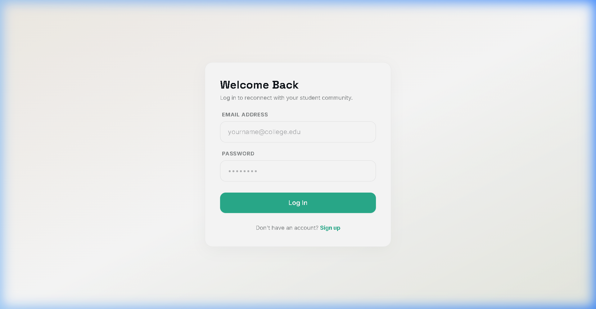

# PeerNexus

[](https://spring.io/projects/spring-boot)
[](https://react.dev/)
[](https://www.postgresql.org/)
[](https://www.docker.com/)
[](LICENSE)

* **Live Demo**: [Vercel Deployment Preview Placeholder]
* **GitHub Repository**: [https://github.com/vivekkushwahaofficial/peernexus](https://github.com/vivekkushwahaofficial/peernexus)

---

## Project Overview

PeerNexus is a secure, collaborative student learning platform designed to bridge academic isolation through structure. Built on a clean full-stack architecture, it integrates a forum-style doubt-solving workspace, study groups boards, gamified reputation points ledger, and low-latency chat networks. 

---

## Problem Statement

During intensive coursework, students face severe roadblocks when solving bugs, studying concepts, or working on assignments. Standard tools are either unmoderated and noisy (chat rooms, discord servers), or exhibit slow asynchronous feedback loops (e.g., standard email threads or legacy discussion forums). This leads to:
* **Academic Isolation:** Lack of prompt verification on bugs.
* **Inability to Discover Peer Support:** No structure to find classmates who possess domain expertise.
* **No Motivation to Contribute:** High-quality replies go unrewarded.

---

## Why This Project Exists

PeerNexus was built to establish a centralized community platform tailored to academic collaboration. By combining the structured organization of a doubt forum with the real-time speed of WebSocket channels, PeerNexus enables:
1. **Accelerated Query Resolutions:** Threaded posts with accepted checks.
2. **Dynamic Sub-Communities:** Targeted study groups for specific subjects.
3. **Verified Credentialing:** Gamified points systems that track verified student contributions and display rank badges on portfolios.

---

## Features

### 🔐 Authentication & Security
* **JWT Stateless Session Control:** Short-lived access tokens (15 mins) manage caller credentials.
* **Dual-Token Handshake:** DB-stored SHA-256 hashed refresh tokens (30 days) rotate sessions securely.
* **Registration Validation:** Registrations restricted to college sub-domains via email SMTP verification tokens.
* **Method-Level Restrictions (RBAC):** Strict Spring Security checks (`STUDENT` < `VERIFIED_STUDENT` < `MODERATOR` < `ADMIN`).

### 👤 User Profiles
* **Presence Tracking:** Online / offline statuses tracked via STOMP broker connection listeners.
* **Portfolios:** Displays skills, interests, bio details, and earned reputation tiers.
* **Avatar Upload Stream:** Multipart uploads mapped directly to Cloudinary CDN storage.

### ❓ Doubt Solving System
* **Markdown Discussion Feed:** Ask academic doubts with subject categories, custom tags, and image attachments.
* **Upvote / Downvote Ledger:** Vote on replies to highlight helpful content.
* **Accepted Solution Checks:** Authors can mark answers as resolved, locking the thread and rewarding the replier.

### 👥 Study Groups
* **Study Rooms Discovery:** Discovery panel displaying public search terms, topics, and descriptions.
* **Access Control Lists:** Join requests for private groups reviewed by group owners/admins.
* **Moderation & Promotion:** Owner tools to promote members to admin, transfer ownership, or kick users.
* **Dedicated WebSocket Channels:** Real-time group chats restricted to verified members.

### 💬 Real-Time Messaging
* **Low-Latency Chat Threads:** Instant private messages with typing indicators and read receipts.
* **Message Management:** Edit messages (within 15 minutes) or delete them for everyone (within 1 hour).
* **Pinning & Reactions:** Pinned message banners and emoji reactions.
* **Local Message Deletion:** Hide chat entries using "Delete for me" database flags.

### 🏆 Reputation System
* **Transactional Point Ledger:** Points history logs preventing tampering (`ANSWER_POSTED`, `ANSWER_ACCEPTED`, `UPVOTE_RECEIVED`).
* **Dynamic Ranking Badges:** Automatic upgrades as reputation grows (Beginner -> Contributor -> Mentor -> Expert -> Legend).
* **Global Leaderboards:** Real-time ranks displaying top contributors.

### 🛡️ Moderation & Audits
* **Content Reporting:** Users can flag content (doubts, answers, groups, messages) for moderation review.
* **Penalty Console:** Moderators can warn, temporarily suspend, or permanently ban users.
* **Security Audit Logs:** Permanent audit trails mapping admin actions for compliance.

### 🔔 Notifications
* **Live Alerts:** Real-time push notifications for connections, answers, upvotes, and moderator warnings.

---

## Screenshots

The following image structure is recommended for local screenshots of PeerNexus UI flows:

```text
screenshots/
├── landing-page.png
├── login-page.png
├── dashboard.png
├── doubts.png
├── groups.png
├── chat.png
├── leaderboard.png
├── profile.png
└── admin-panel.png
```

* **Landing Page Preview**
  
* **Student Login Gateway**
  
* **Workspace Dashboard & Doubt Feed**
  
* **WebSocket Real-Time Chat**
  

---

## Architecture Diagram

PeerNexus uses a client-server architecture with secure real-time messaging pathways:

```text
                               +----------------------------------+
                               |           User Browser           |
                               +----------------------------------+
                                             |        ^
                                  HTTPS REST |        |  STOMP WebSockets
                                             v        v
                               +----------------------------------+
                               |    Nginx Reverse Proxy / CORS    |
                               +----------------------------------+
                                             |        ^
                                             v        |
                               +----------------------------------+
                               |  Spring Boot 3 Backend Service   |
                               +----------------------------------+
                                 /           |           \
                    JPA / SQL   /            |            \   Multipart Stream
                               v             v             v
                          +----------+  +------------+  +---------------+
                          | Postgres |  | H2 Memory  |  |  Cloudinary   |
                          | Database |  | (Testing)  |  |  Media Cloud  |
                          +----------+  +------------+  +---------------+
```

---

## Technology Stack

| Layer | Component | Version | Description |
| :--- | :--- | :--- | :--- |
| **Frontend** | React | 18.3.1 | UI rendering library |
| | Vite | 5.4.0 | Build compiler & hot-reloading dev server |
| | Tailwind CSS | 3.4.9 | Custom utility styles |
| | React Router Dom | 6.26.1 | Client page routing |
| | TanStack Query | 5.51.0 | State caching, automatic query refetching |
| | Axios | 1.7.3 | HTTP client with security token interceptors |
| | STOMP JS / SockJS | 7.3.0 / 1.6.1 | WebSocket orchestration and heartbeat sync |
| **Backend** | Spring Boot | 3.5.14 | Core REST & WebSocket server layer |
| | Spring Security | 6.x | Security Filter Chain & RBAC validation |
| | JWT (JJWT) | 0.12.5 | Cryptographic user token generator |
| | MapStruct | 1.5.5.Final | Type-safe mappings between entities and DTOs |
| | Hibernate / JPA | 6.x / 3.x | ORM mapping database tables |
| | Spring Mail | 3.x | Transactional registration and reset emails |
| **Database** | PostgreSQL | 16.x (Alpine) | Transactional, indexed data storage |
| | Flyway | 10.x | Schema migrations and structure versioning |
| | H2 Database | 2.2.x | In-memory database for unit tests |
| **DevOps** | Docker | 26.x | Container deployment package compiler |
| | Docker Compose | 3.9 | Multi-container environment orchestrator |

---

## System Design

### Database Design
```text
               +-----------------------------+
               |            users            |
               +-----------------------------+
               | PK  id (bigint)             |
               |     email (varchar)  [UQ]   |
               |     password (varchar)      |
               |     role (varchar)          |
               |     reputation_points (int) |
               +-----------------------------+
                 ^    ^      ^    ^      ^
                 |    |      |    |      |
        +--------+    |      |    |      +--------+
        |             |      |    |               |
        v             |      |    v               v
  +-----------+       |      |  +-----------+   +-------------+
  |  doubts   |       |      |  |connections|   |group_members|
  +-----------+       |      |  +-----------+   +-------------+
  | PK  id    |       |      |  | PK  id    |   | PK  id      |
  | FK  author|<------+      |  | FK  reques|   | FK  group_id|
  +-----------+              |  | FK  recip |   | FK  user_id |
    ^                        |  +-----------+   +-------------+
    |                        |                    ^
    v                        v                    |
  +-----------+            +------------+         v
  |  answers  |            | chat_rooms |       +-------------+
  +-----------+            +------------+       |study_groups |
  | PK  id    |            | PK  id     |       +-------------+
  | FK  doubt |            | FK  user1  |       | PK  id      |
  | FK  author|<-----------| FK  user2  |       +-------------+
  +-----------+            +------------+
                             ^
                             |
                             v
                           +------------+
                           |  messages  |
                           +------------+
                           | PK  id     |
                           | FK  room_id|
                           | FK  sender |
                           +------------+
```

* **Core Relationships:**
  * `User` to `Doubt` and `Answer` is **One-to-Many** (cascade delete blocked).
  * `Doubt` to `Answer` is **One-to-Many** (cascade delete enabled).
  * `User` to `StudyGroup` is **Many-to-Many** mapped via `group_members` containing custom membership metadata (`OWNER`, `ADMIN`, `MEMBER`).
  * `ChatRoom` maps user pairs (**One-to-One** unique key user1_id, user2_id), which links to `messages` (**One-to-Many**).
  * Peer invitations map to `connections` (**One-to-Many**) tracking statuses (`PENDING`, `ACCEPTED`, `REJECTED`, `CANCELED`).

### Authentication Flow
```text
[User Client]           [AuthController]          [DB/PostgreSQL]         [SMTP Server]
      |                        |                         |                      |
      |--- POST /register ---->|                         |                      |
      |                        |--- Save User (unverified)-->|                  |
      |                        |--- Generate verification ----|                  |
      |                        |--- Send verification email ------------------->|
      |                        |                         |                      |
      |--- GET /verify ------->|                         |                      |
      |                        |--- Update enabled=true->|                      |
      |                        |<-- Success HTTP 200 ----|                      |
      |                        |                         |                      |
      |--- POST /login ------->|                         |                      |
      |                        |--- Validate bcrypt hash |                      |
      |                        |--- Generate JWT Access  |                      |
      |                        |--- Save Refresh Token ->|                      |
      |<-- Return Access JWT --|                         |                      |
```

### WebSocket Flow
WebSocket communication uses custom interceptors to authenticate handshakes and check subscriptions:

```text
[Client WS Connection]
          |
          v--- STOMP CONNECT Frame (nativeHeaders: "Authorization: Bearer <token>")
[WebSocketSecurityConfig Interceptor]
          |--- Extract Token & Validate signature via JwtService
          |--- Valid: Set user principal on connection session
          |--- Invalid: Reject Connection, Throw IllegalArgumentException
          |
          v--- STOMP SUBSCRIBE Frame (destination: "/topic/group.{groupId}")
[WebSocketSecurityConfig Interceptor]
          |--- Extract group ID & Authenticated user ID from principal
          |--- Check membership (existsByGroupIdAndUserId) in DB
          |--- Is Member: Complete subscription stream mappings
          |--- Not Member: Send STOMP ERROR Frame, Deny Subscription
```

---

## API Documentation

### Authentication (`/api/auth`)
| Method | Endpoint | Payload | Description |
| :--- | :--- | :--- | :--- |
| **POST** | `/api/auth/register` | `SignupRequest` JSON | Register new user profile |
| **POST** | `/api/auth/login` | `LoginRequest` JSON | Authenticate credentials & return JWT keys |
| **POST** | `/api/auth/refresh` | Query Header token | Exchange refresh token for fresh access JWT |
| **POST** | `/api/auth/logout` | None | Revoke refresh token and invalidate session |
| **GET** | `/api/auth/verify` | `?token=...` | Validate registration email token |
| **POST** | `/api/auth/forgot-password`| `EmailRequest` JSON | Generate reset token and dispatch email |
| **POST** | `/api/auth/reset-password` | `ResetRequest` JSON | Finalize password reset using token |

### User Directory & Connections (`/api/users` & `/api/connections`)
| Method | Endpoint | Role Allowed | Description |
| :--- | :--- | :--- | :--- |
| **GET** | `/api/users/me` | `STUDENT` | Fetch active user profile and authorities |
| **GET** | `/api/users/{id}` | `STUDENT` | Fetch public profile metadata of a student |
| **PUT** | `/api/users/me` | `STUDENT` | Update profile bio, skills, and interests |
| **POST** | `/api/connections/request`| `STUDENT` | Send connection request to another student |
| **POST** | `/api/connections/{id}/accept`| `STUDENT` | Accept incoming connection request |
| **DELETE**| `/api/connections/{id}` | `STUDENT` | Terminate established peer connection |
| **GET** | `/api/connections` | `STUDENT` | List active peer connections (paginated) |

### Doubt Forum (`/api/doubts` & `/api/answers`)
| Method | Endpoint | Role Allowed | Description |
| :--- | :--- | :--- | :--- |
| **GET** | `/api/doubts` | `ANONYMOUS` | List doubts feed (paginated) |
| **POST** | `/api/doubts` | `VERIFIED_STUDENT`| Create a new doubt entry |
| **DELETE**| `/api/doubts/{id}` | `MODERATOR` | Delete doubt post (owner/moderator only) |
| **POST** | `/api/answers` | `VERIFIED_STUDENT`| Submit answer text for a doubt |
| **POST** | `/api/answers/{id}/accept`| `VERIFIED_STUDENT`| Accept answer as solution (owner only) |
| **POST** | `/api/answers/{id}/vote` | `VERIFIED_STUDENT`| Cast upvote/downvote for answer |

### Real-Time Chat & Inbox (`/api/chat` & `/api/group-chat`)
| Method | Endpoint | Role Allowed | Description |
| :--- | :--- | :--- | :--- |
| **GET** | `/api/chat/rooms` | `STUDENT` | Retrieve chat rooms inbox feed with counts |
| **POST** | `/api/chat/rooms/{userId}/or-create`| `STUDENT` | Open chat room with user (needs accepted connection) |
| **GET** | `/api/chat/rooms/{roomId}/messages`| `STUDENT` | Paginated message logs history |
| **GET** | `/api/group-chat/{groupId}/messages`| `STUDENT` | Paginated message history for study groups |
| **POST** | `/api/chat/messages/{messageId}/pin`| `STUDENT` | Pin/unpin a message in the room |

---

## Security Features

* **JWT Stateless Session filter:** Intercepts REST request headers, extracting validation tokens prior to execution.
* **Hibernate Entity Detachment:** Plaintext tokens are detached from database persistence contexts (`entityManager.detach`) to prevent accidental updates via Hibernate dirty-checking.
* **IDOR Shield:** Core services validate user resource ownership before executing mutations (edit, delete, accepted status changes).
* **Input Sanitization & Attachment Filters:** Rejects raw executable file patterns (MZ headers) and whitelists attachments (PDF, DOCX, standard images).
* **WebSocket Channel Interceptors:** Connect handshakes check JWT signatures, and subscriptions check database group membership.
* **CORS Limits:** Allowed origins restricted to config properties, blocking generic wildcards.

---

## Local Setup

### Prerequisites
1. **Java SDK 21**
2. **Maven 3.9+**
3. **Node.js 18+ & npm**
4. **PostgreSQL 16**
5. **Cloudinary Account**

### Backend Setup
1. Navigate to the backend directory:
   ```bash
   cd peernexus-backend
   ```
2. Copy the template `.env.example` file to `.env` and fill in your database, email server, and Cloudinary credentials:
   ```bash
   cp .env.example .env
   ```
3. Compile the application:
   ```bash
   ./mvnw clean install
   ```
4. Start the Spring Boot API server:
   ```bash
   ./mvnw spring-boot:run
   ```

### Frontend Setup
1. Navigate to the frontend directory:
   ```bash
   cd ../peernexus-frontend
   ```
2. Create your local environment configuration file:
   ```bash
   cp .env.example .env.local
   ```
3. Install package dependencies:
   ```bash
   npm install
   ```
4. Launch the local development hot-reloading server:
   ```bash
   npm run dev
   ```
   The client will boot on `http://localhost:5173`.

---

## Docker Setup

To spin up the database, Spring Boot microservices, and Nginx frontend server using Docker:
1. Ensure your `.env` variables at the project root folder are populated.
2. Build and launch the containers:
   ```bash
   docker compose up --build
   ```
   The application will be accessible at `http://localhost:3000`.

---

## Deployment Guide

### Backend Deployment (Railway, Render, AWS)
1. Provision a managed PostgreSQL database instance and configure production environment variables.
2. Link the repository, setting the root folder to `peernexus-backend`.
3. Set the build compile command:
   ```bash
   ./mvnw clean package -DskipTests
   ```
4. Configure the start execution parameter:
   ```bash
   java -jar target/peernexus-0.0.1-SNAPSHOT.jar
   ```

### Frontend Deployment (Vercel)
1. Add the project directory pointing to `peernexus-frontend`.
2. Configure build environment settings:
   * **Build Command:** `npm run build`
   * **Output Directory:** `dist`
3. Add the `VITE_API_BASE_URL` environment variable pointing to the deployed backend address.

---

## Project Structure

```text
peernexus/
├── docker-compose.yml              # Multi-container orchestration config
├── .env.example                    # Template for required environment variables
├── README.md                       # Comprehensive project documentation
├── verify_group_enter_*.webp       # Media asset for visual validation
├── peernexus-backend/              # Spring Boot Backend Codebase
│   ├── Dockerfile                  # Multi-stage JVM runtime build instructions
│   ├── pom.xml                     # Maven dependency mapping
│   ├── schema.sql                  # Auto-generated SQL schema dump
│   ├── docs/                       # Modules API documentation
│   └── src/
│       ├── main/
│       │   ├── java/com/peernexus/peernexus/
│       │   │   ├── admin/           # Moderation, reports, dashboard and audit logging
│       │   │   ├── answer/          # Doubt replies and vote tracking
│       │   │   ├── auth/            # JWT validation, signup, reset tokens
│       │   │   ├── chat/            # Private chat room REST and STOMP handlers
│       │   │   ├── cloudinary/     # Cloudinary media upload/delete endpoints
│       │   │   ├── common/          # Global exceptions, standard response wrappers
│       │   │   ├── config/          # CORS, Spring Security, WebSockets mapping
│       │   │   ├── connection/      # Peer invitations network layer
│       │   │   ├── doubt/           # Forum doubt feed, tag aggregation
│       │   │   ├── group/           # Study group metadata, admin, and catalogs
│       │   │   ├── groupchat/       # Study group real-time messaging
│       │   │   ├── notification/   # In-app alert triggers and storage
│       │   │   ├── reputation/     # Point transaction engine and leaderboard
│       │   │   └── user/            # User profile services
│       │   └── resources/
│       │       ├── db/migration/   # Flyway versioned SQL scripts V1-V14
│       │       └── application.properties
│       └── test/                    # In-memory integration tests
└── peernexus-frontend/             # React Frontend Codebase
    ├── Dockerfile                  # Multi-stage Vite static Nginx build
    ├── package.json                # NPM dependency management
    ├── tailwind.config.js          # Styling configurations
    ├── vite.config.js              # Vite configurations
    └── src/
        ├── components/             # Reusable UI widgets and layout views
        ├── context/                # React state providers (Auth, WS)
        ├── hooks/                  # Custom hooks (WS handlers, UI helpers)
        ├── pages/                  # Views (DoubtFeed, Admin, ChatPage, etc.)
        ├── router/                 # Secure layout routing mapping
        ├── services/               # REST client modules (Axios setup)
        └── websocket/              # WebSocket configuration settings
```

---

## Challenges Solved

1. **State & Connection Synchronization:** Integrating low-latency WebSockets with Spring Security's thread-local security context. I implemented custom channel interceptors to extract and validate JWT tokens on `CONNECT` frames.
2. **Subscription Leak Prevention:** Preventing unauthorized users from listening to private study group channels. I designed runtime subscription checks that validate membership against the database before allowing subscription mapping.
3. **Database Performance & N+1 Queries:** Optimizing complex feeds (e.g., matching users, doubt replies, reputation scores). I resolved N+1 query bottlenecks by defining custom JPA Join Fetch mappings, reducing database calls on dashboard loads.

---

## Lessons Learned

* **State Persistence in Real-time Channels:** Learned that keeping track of chat status (sent, read) requires syncing memory buffers with database states carefully, which can be optimized using custom WebSocket channels.
* **Hibernate Entity State Audits:** Discovered the risk of Hibernate "dirty-checking" updating password fields or registration tokens during REST sessions. This was solved by explicitly detaching transient objects using `entityManager.detach`.
* **Clean Multi-Stage Docker Builds:** Realized the performance benefits of caching dependency downloads in the builder stage to compile Docker images rapidly without repeating package retrieval.

---

## Future Improvements

* **Redis Caching Layer:** Offload WebSocket session states to a Redis Pub/Sub cluster to support horizontal scaling of application instances.
* **Elasticsearch Indexing:** Replace basic database queries with a dedicated search index for doubt posts and attachments.
* **WebRTC Live Study Rooms:** Add virtual video study options inside group workspaces.
* **AI Doubt Classification:** Integrate local LLMs to automatically classify doubt posts and flag toxic answers.

---

## Contributing

1. Fork the repository.
2. Create your Feature Branch: `git checkout -b feature/NewFeature`
3. Commit your changes: `git commit -m 'Add NewFeature'`
4. Push to the branch: `git push origin feature/NewFeature`
5. Open a Pull Request.

---

## License

This project is licensed under the MIT License. See the [LICENSE](LICENSE) file for details.

---

## Author

* **Vivek Kushwaha** - *Lead Engineer / Architect*
  * **GitHub**: [github.com/vivekkushwahaofficial](https://github.com/vivekkushwahaofficial)
  * **LinkedIn**: [linkedin.com/in/vivekkushwahaofficial](https://www.linkedin.com/in/vivekkushwahaofficial)
  * **Portfolio**: [vivekkushwaha.dev](https://vivekkushwaha.dev)
