# PeerNexus — Tech Stack & Architecture Flow

> **Presentation-Ready Analysis** — Vivek Kushwaha | Infosys Springboard

---

## 1. High-Level Architecture Overview

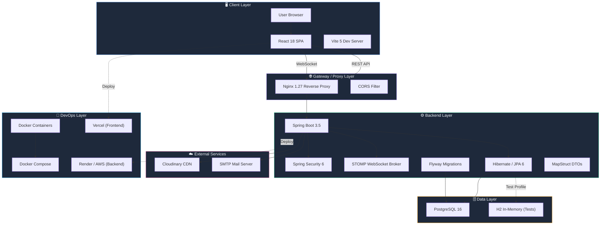

---

## 2. Tech Stack Breakdown (By Layer)

### 🎨 Frontend Stack

| Technology | Version | Purpose |
|:---|:---|:---|
| **React** | 18.3.1 | Component-based UI library |
| **Vite** | 5.4.0 | Lightning-fast build tool & HMR dev server |
| **Tailwind CSS** | 3.4.9 | Utility-first CSS framework |
| **React Router DOM** | 6.26.1 | Declarative client-side routing with nested layouts |
| **TanStack React Query** | 5.51.0 | Server-state caching, auto-refetching, optimistic updates |
| **Axios** | 1.7.3 | HTTP client with JWT interceptors & refresh token rotation |
| **STOMP.js** | 7.3.0 | WebSocket messaging over STOMP protocol |
| **SockJS Client** | 1.6.1 | WebSocket fallback for legacy browser support |
| **PostCSS** | 8.4.41 | CSS transformer pipeline |
| **Autoprefixer** | 10.4.20 | Automatic vendor prefix injection |

### ⚙️ Backend Stack

| Technology | Version | Purpose |
|:---|:---|:---|
| **Spring Boot** | 3.5.14 | Opinionated Java framework for REST + WebSocket services |
| **Spring Security** | 6.x | Authentication filter chain, RBAC, CORS |
| **Spring Data JPA** | 3.x | Repository abstraction over Hibernate ORM |
| **Hibernate** | 6.x | Object-Relational Mapping with Join Fetch optimizations |
| **Spring WebSocket** | 3.x | STOMP broker relay + SockJS server endpoints |
| **Spring Mail** | 3.x | Transactional email (registration, password reset) |
| **Spring Actuator** | 3.x | Health checks, metrics, and monitoring endpoints |
| **Spring Validation** | 3.x | Bean validation with `@Valid` annotations |
| **JJWT** | 0.12.5 | JWT token generation, signing (HS256), and parsing |
| **MapStruct** | 1.5.5 | Compile-time type-safe entity ↔ DTO mapping |
| **Lombok** | Latest | Boilerplate reduction (`@Data`, `@Builder`, etc.) |
| **Java** | 21 (LTS) | Language runtime with virtual threads support |
| **Maven** | 3.9+ | Dependency management & build lifecycle |

### 🗄️ Database & Migrations

| Technology | Version | Purpose |
|:---|:---|:---|
| **PostgreSQL** | 16 (Alpine) | Production relational database with ACID compliance |
| **Flyway** | 10.x | Version-controlled schema migrations |
| **H2** | 2.2.x | In-memory database for unit/integration tests |

### ☁️ External Services

| Service | Purpose |
|:---|:---|
| **Cloudinary** | CDN for user avatars, group headers, chat attachments |
| **Gmail SMTP** | Email verification codes & password reset links |

### 🐳 DevOps & Deployment

| Technology | Purpose |
|:---|:---|
| **Docker** | Multi-stage containerized builds (JDK → JRE, Node → Nginx) |
| **Docker Compose** | Full-stack orchestration (PostgreSQL + Backend + Frontend) |
| **Nginx** | Production static file server + SPA fallback routing |
| **Vercel** | Frontend CDN deployment (live at `peernexus.vercel.app`) |
| **Render / AWS** | Backend JAR hosting with managed PostgreSQL |

---

## 3. Frontend Architecture Flow

```mermaid
graph LR
    subgraph PAGES["📄 Pages (10 modules)"]
        Home["Home / Landing"]
        Login["Login"]
        Register["Register"]
        Doubts["Doubts Forum"]
        Chat["Chat Inbox"]
        Groups["Study Groups"]
        Profile["User Profile"]
        Connections["Connections"]
        Leaderboard["Leaderboard"]
        Admin["Admin Panel"]
    end

    subgraph COMPONENTS["🧩 Reusable Components"]
        Layout["Layout Shell"]
        ChatComps["Chat Components"]
        GroupComps["Group Components"]
        Forms["Form Components"]
        Common["Common UI"]
        AdminComps["Admin Components"]
    end

    subgraph STATE["🔄 State Management"]
        AuthCtx["AuthContext"]
        ToastCtx["ToastContext"]
        WSCtx["WebSocketContext"]
        RQ["TanStack React Query"]
    end

    subgraph SERVICES["📡 API Services (13 modules)"]
        ApiClient["apiClient.js (Axios + JWT Interceptor)"]
        AuthSvc["authService"]
        UserSvc["userService"]
        DoubtSvc["doubtService"]
        AnswerSvc["answerService"]
        ChatSvc["chatService"]
        ConnSvc["connectionService"]
        GroupSvc["groupService"]
        GroupChatSvc["groupChatService"]
        RepSvc["reputationService"]
        NotifSvc["notificationService"]
        AdminSvc["adminService"]
        CloudSvc["cloudinaryService"]
    end

    subgraph HOOKS["🪝 Custom Hooks (12)"]
        UseAuth["useAuth"]
        UseDoubts["useDoubts"]
        UseChat["useChat"]
        UseGroups["useGroups"]
        UseConn["useConnections"]
        UseAnswers["useAnswers"]
        UseAdmin["useAdmin"]
        UseReputation["useReputation"]
        UseNotifs["useNotifications"]
        UseGroupChat["useGroupChat"]
        UseToast["useToast"]
        UseWS["useWebSocket"]
    end

    subgraph WEBSOCKET["⚡ WebSocket Layer"]
        StompClient["stompClient.js"]
        ChatSocket["chatSocket.js"]
        GroupSocket["groupSocket.js"]
    end

    PAGES --> COMPONENTS
    PAGES --> HOOKS
    HOOKS --> SERVICES
    HOOKS --> STATE
    SERVICES --> ApiClient
    STATE --> WEBSOCKET
    ApiClient -->|HTTP REST| Backend["Spring Boot API :8080"]
    WEBSOCKET -->|STOMP / SockJS| Backend

    style PAGES fill:#0f172a,stroke:#60a5fa,color:#e2e8f0
    style COMPONENTS fill:#0f172a,stroke:#a78bfa,color:#e2e8f0
    style STATE fill:#0f172a,stroke:#34d399,color:#e2e8f0
    style SERVICES fill:#0f172a,stroke:#f59e0b,color:#e2e8f0
    style HOOKS fill:#0f172a,stroke:#fb923c,color:#e2e8f0
    style WEBSOCKET fill:#0f172a,stroke:#f472b6,color:#e2e8f0
```

---

## 4. Backend Module Architecture

```mermaid
graph TB
    subgraph MODULES["Spring Boot Backend Modules"]
        direction TB
        Auth["🔐 auth<br/>controller / dto / entity / repository / service"]
        User["👤 user<br/>controller / dto / entity / repository / service"]
        Doubt["❓ doubt<br/>controller / dto / entity / repository / service"]
        Answer["💡 answer<br/>controller / dto / entity / repository / service"]
        Chat["💬 chat<br/>controller / dto / entity / repository / service"]
        GroupChat["📢 groupchat<br/>controller / dto / entity / repository / service"]
        Group["👥 group<br/>controller / dto / entity / repository / service"]
        Connection["🤝 connection<br/>controller / dto / entity / repository / service"]
        Reputation["🏆 reputation<br/>controller / dto / entity / repository / service"]
        Notification["🔔 notification<br/>controller / dto / entity / repository / service"]
        Admin["🛡️ admin<br/>controller / dto / entity / repository / service"]
        Email["📧 email<br/>service"]
        CloudinaryMod["☁️ cloudinary<br/>config / service"]
    end

    subgraph CONFIG["⚙️ Configuration Layer"]
        SecConfig["SecurityConfig<br/>Filter Chain + RBAC"]
        JwtFilter["JwtAuthenticationFilter<br/>Token Extraction + Validation"]
        JwtService["JwtService<br/>Token Generation + Parsing"]
        WSConfig["WebSocketConfig<br/>STOMP Endpoints + Broker"]
        WSSecConfig["WebSocketSecurityConfig<br/>Channel Interceptors"]
        CloudConfig["CloudinaryConfig<br/>SDK Bean Setup"]
        FlyConfig["FlywayConfig<br/>Migration Runner"]
        DBSeeder["DatabaseSeeder<br/>Initial Admin User"]
    end

    subgraph CROSS_CUTTING["🔧 Cross-Cutting"]
        Common["common<br/>Shared DTOs + Enums"]
        Exception["exception<br/>Global Error Handlers"]
    end

    Auth --> SecConfig
    Auth --> JwtService
    SecConfig --> JwtFilter
    Chat --> WSConfig
    GroupChat --> WSSecConfig
    CloudinaryMod --> CloudConfig
    
    style MODULES fill:#0f172a,stroke:#34d399,color:#e2e8f0
    style CONFIG fill:#0f172a,stroke:#f59e0b,color:#e2e8f0
    style CROSS_CUTTING fill:#0f172a,stroke:#94a3b8,color:#e2e8f0
```

---

## 5. Request Lifecycle & Security Flow

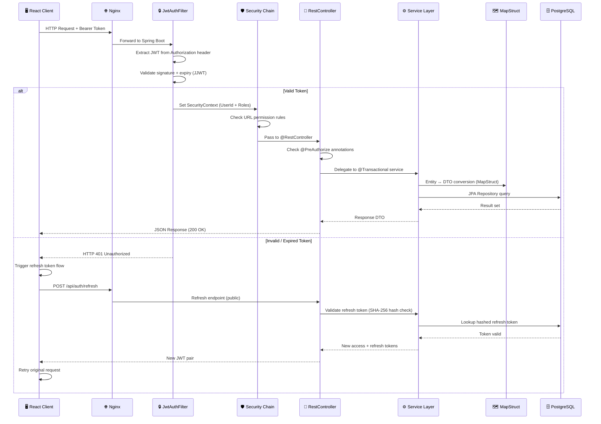

---

## 6. JWT Authentication Flow (Dual-Token)

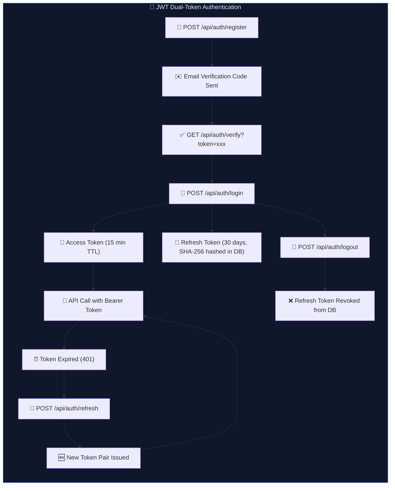

---

## 7. Real-Time WebSocket Architecture

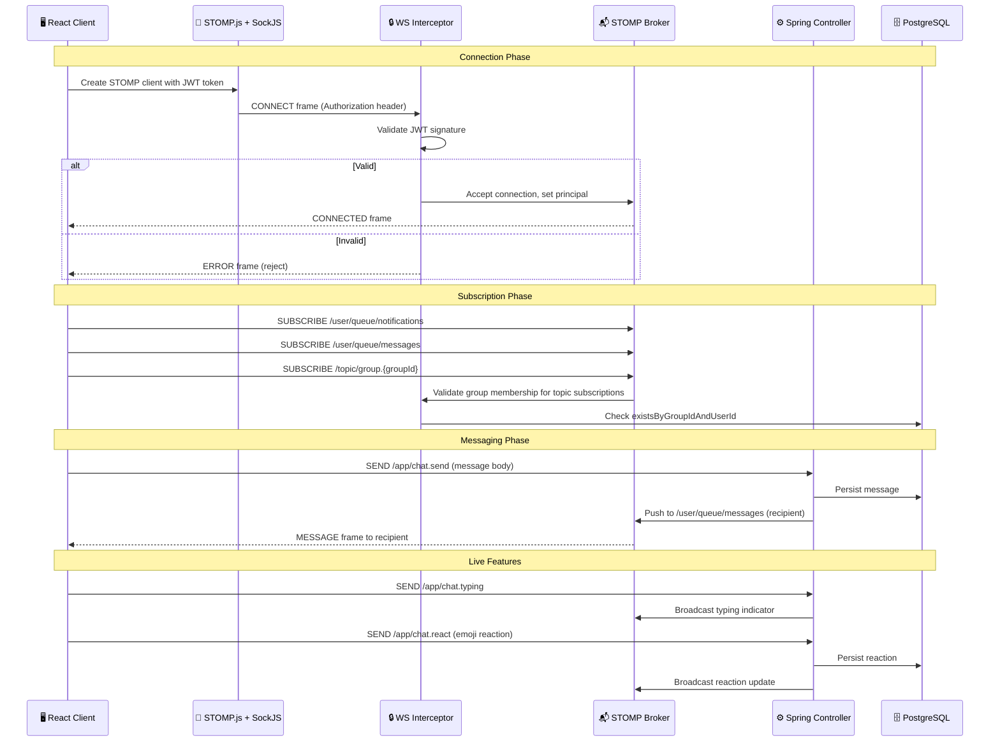

---

## 8. Data Flow — Complete Request Pipeline

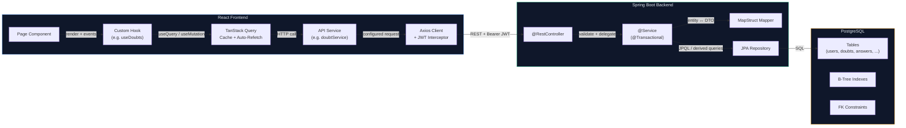

---

## 9. Docker Deployment Architecture

```mermaid
graph TB
    subgraph COMPOSE["🐳 Docker Compose (docker-compose.yml)"]
        direction TB
        
        subgraph PG_CONTAINER["PostgreSQL Container"]
            PG_IMG["postgres:16-alpine"]
            PG_VOL["Volume: postgres_data"]
            PG_PORT["Port: 5432"]
            PG_HEALTH["Healthcheck: pg_isready"]
        end

        subgraph BACKEND_CONTAINER["Backend Container (Multi-Stage)"]
            BUILD_STAGE["Stage 1: eclipse-temurin:21-jdk<br/>mvnw package -DskipTests"]
            RUN_STAGE["Stage 2: eclipse-temurin:21-jre<br/>Non-root user 'peernexus'"]
            BE_PORT["Port: 8080"]
            BE_HEALTH["Healthcheck: /actuator/health"]
        end

        subgraph FRONTEND_CONTAINER["Frontend Container (Multi-Stage)"]
            FE_BUILD["Stage 1: node:20-alpine<br/>npm ci + npm run build"]
            FE_SERVE["Stage 2: nginx:1.27-alpine<br/>SPA fallback routing"]
            FE_PORT["Port: 3000 → 80"]
        end
    end

    subgraph NETWORK["🔗 peernexus-net (bridge)"]
        NET["Internal Docker Network"]
    end

    FRONTEND_CONTAINER -->|depends_on| BACKEND_CONTAINER
    BACKEND_CONTAINER -->|depends_on (healthy)| PG_CONTAINER
    PG_CONTAINER --> NET
    BACKEND_CONTAINER --> NET
    FRONTEND_CONTAINER --> NET

    style COMPOSE fill:#0f172a,stroke:#38bdf8,color:#e2e8f0
    style PG_CONTAINER fill:#1e293b,stroke:#f59e0b,color:#e2e8f0
    style BACKEND_CONTAINER fill:#1e293b,stroke:#34d399,color:#e2e8f0
    style FRONTEND_CONTAINER fill:#1e293b,stroke:#60a5fa,color:#e2e8f0
    style NETWORK fill:#1e293b,stroke:#a78bfa,color:#e2e8f0
```

---

## 10. Role-Based Access Control (RBAC) Hierarchy

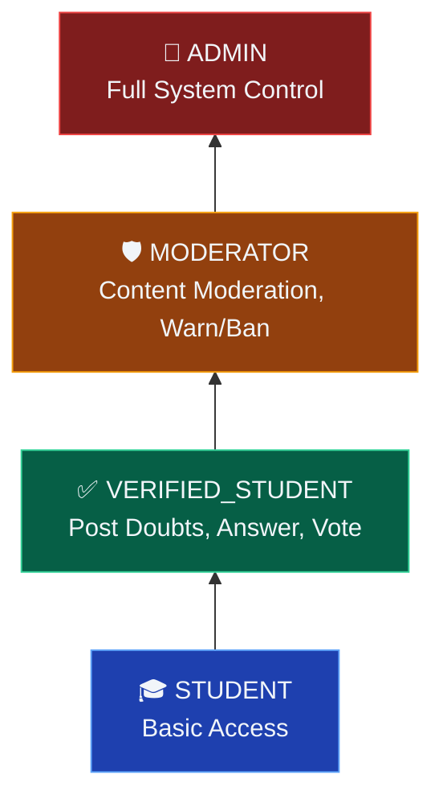

| Role | Capabilities |
|:---|:---|
| `STUDENT` | View doubts, browse profiles, manage connections, private chat |
| `VERIFIED_STUDENT` | + Post doubts, submit answers, vote, create groups |
| `MODERATOR` | + Delete content, warn/suspend/ban users, review reports |
| `ADMIN` | + Full user management, system configuration, audit logs |

---

## 11. Reputation System Flow

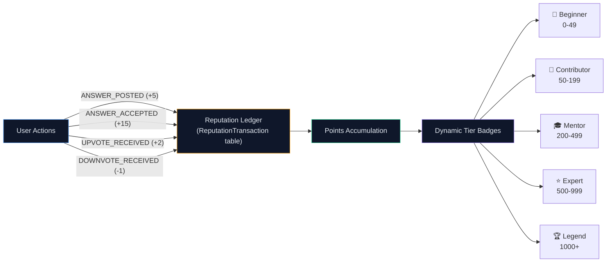

---

## 12. Database Schema Relationships

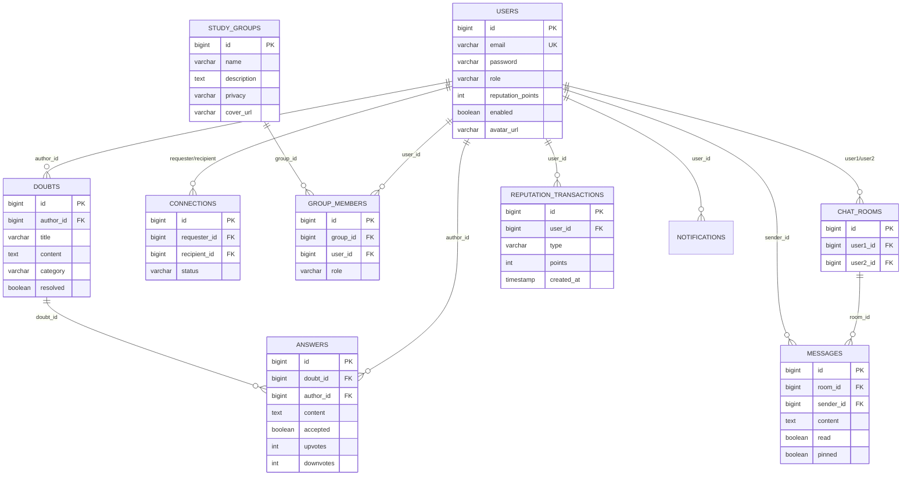

---

## 13. Production Deployment Flow

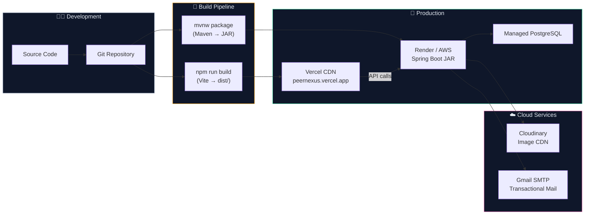

---

## 14. Feature Module Summary

| Module | Frontend Pages | Backend Package | Key Endpoints |
|:---|:---|:---|:---|
| **Auth** | Login, Register | `auth/` | `/api/auth/register`, `/login`, `/refresh`, `/verify` |
| **Profiles** | Profile, EditProfile | `user/` | `/api/users/me`, `/api/users/{id}` |
| **Doubts** | DoubtFeed, DoubtDetail | `doubt/` + `answer/` | `/api/doubts`, `/api/answers` |
| **Chat** | ChatInbox, ChatRoom | `chat/` | `/api/chat/rooms`, WebSocket STOMP |
| **Groups** | GroupList, GroupDetail | `group/` + `groupchat/` | `/api/groups`, WebSocket topics |
| **Connections** | ConnectionsList | `connection/` | `/api/connections` |
| **Reputation** | Leaderboard | `reputation/` | `/api/reputation` |
| **Notifications** | NotificationBell | `notification/` | `/api/notifications` + WebSocket push |
| **Admin** | AdminModeration | `admin/` | `/api/admin/*` |
| **Media** | — | `cloudinary/` | Upload/Delete via Cloudinary SDK |
| **Email** | — | `email/` | Internal service (verification, reset) |

---

## 15. Key Engineering Patterns Used

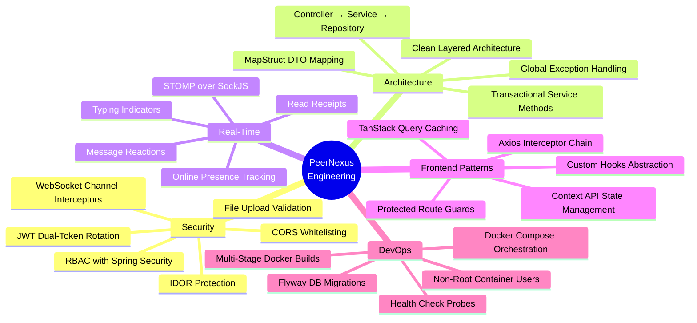

---

## 16. Tech Stack Visual Summary (Presentation Slide)

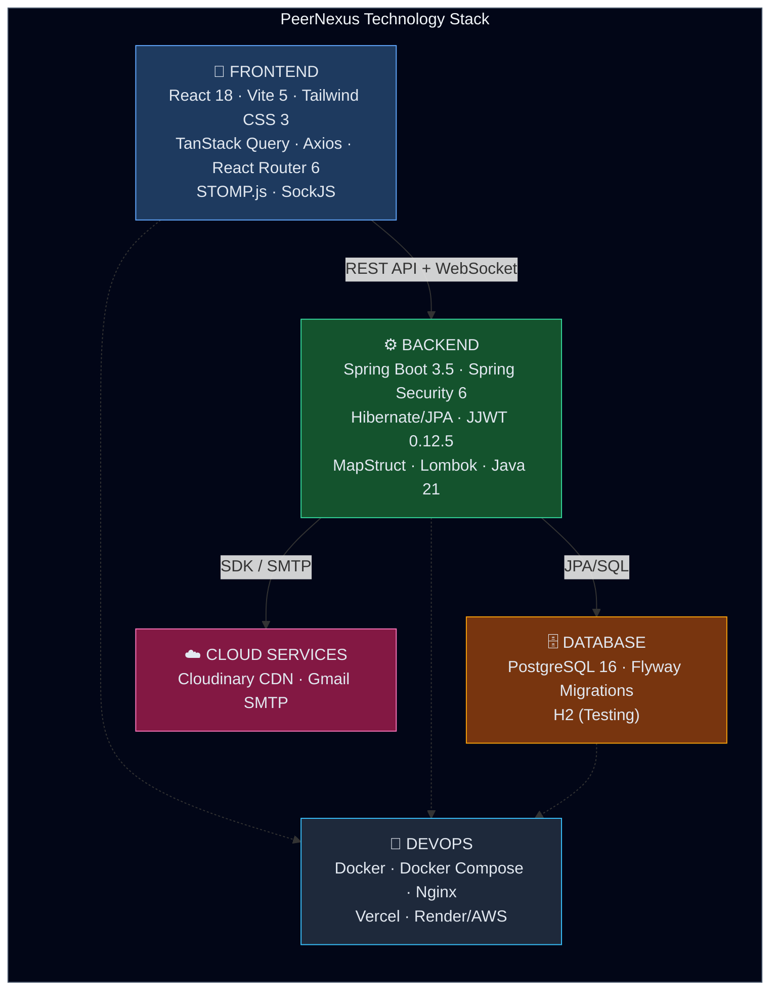

---

> **Live Demo**: [peernexus.vercel.app](https://peernexus.vercel.app) · **Repository**: [github.com/vivekkushwahaofficial/peernexus](https://github.com/vivekkushwahaofficial/peernexus)
